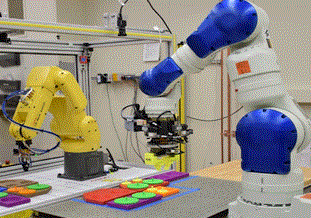
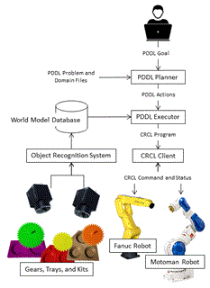
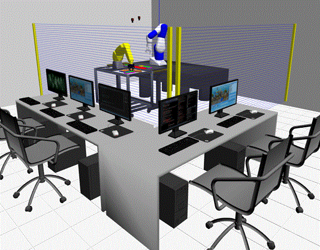

# Physics Based Simulation of the Agility Laboratory at NIST
 
----

Tuesday, July 24, 2018

GazeboNotes.docx

# Background

Industrial robots have traditionally been applied to automate tasks that are dirty, dull, or dangerous, and have been a key driver of continued productivity growth in high-volume applications such as automotive and electronics manufacturing. Worldwide, there were about 1.8 million installed industrial robots at the end of 2016, with a 10 % annual growth rate since 2010 [1, 2]. In these high-volume applications, the typically long up-front programming times required were acceptable. However, as manufacturing moves toward more flexibility to support quickly changing product requirements in a high-mix, low-volume environment, robots need to become more agile. Agility in this context refers to the ability of a robot to be rapidly re-tasked for new activities without being taken offline for programming; the ability of a robot to recover from errors or uncertainty in the environment; and the ability to move applications between robots from different vendors without the need for program translation.

The Agility Performance of Robotics System (APRS) laboratory at the National Institute of Standards and Technology (NIST) contains two industrial robots, a Fanuc LR-Mate 200iD and a Motoman SIA20F. The robots share tooling for open-and close gripping and vacuum gripping. The primary application is kitting, where parts are moved from their initial location in storage trays to a final target arrangement in kit trays. Overhead cameras in the work volume are used to determine the location of parts, storage trays, and kit trays. This laboratory is shown in Figure 1. 

<p align="center">

</p>




Figure 2 shows the APRS system architecture. The purpose of the system is to put together kits of parts based on a request composed by the operator, shown at the top of the figure. The resulting PDDL goal is a set of kits and their contents of parts. This goal is sent to the PDDL planner, which consults the definitions of actions, preconditions, and postconditions in the kitting problem domain and determines a feasible sequence of actions that achieve the kitting goal. These actions are sent to the PDDL executor, which fills in actual values for part and kit locations based on the current state in the world model database. This database is continually updated with the locations of parts as measured by the object recognition system. After the actions are instantiated, the resulting CRCL program is sent to the CRCL client for execution. This client steps through the program, sending messages to the robots and grippers and monitoring execution status until the program has completed. Any failures are reported by the client, which triggers replanning if possible until the kitting request is fulfilled, or stopped due to unrecoverable problems. 

<p align="center">

</p>




<p align="center">

</p>
<p align="center">
**_Figure 1. System Architecture._** 
</p>
The NIST agility kitting robot control laboratory was ported to a physics-based simulation environment. Simulation can be kinematic or physics-based. Kinematic simulation uses visualization of the sequence of operations to verify correctness. Physics-based simulation models the physical elements' interactions and collisions, and the effects of physical properties such as gravity, friction and inertia. The intent of physics-based simulation is to study control and sensing, reveal inaccuracies, and verify correctness. For example, placing of a "gear" into a slot holder in visualization simulation could overlay two images at the bottom of the slot (the gear and holder) without repercussions. However, in the case of physics-based simulation, the gear would "bounce" out of the slot as it is physically impossible for a solid object to atomically combine with another solid object.




<p align="center">
_Figure 2 Physics Based Simulation of the Agility Laborator_
</p>


Implementing Physics Based Robot  Gripping Control Using Gazebo

### Implementing Velocity/Force Control for Gazebo Gripper

The Gazebo tutorial http://gazebosim.org/tutorials?tut=set_velocity offers a way to configure a Joint controller to be based on velocity control.  In Gazebo, configuring a joint motor is done using Joint::SetParam(), for example:

	          this->model->GetJoint("ajoint")->SetParam("fmax", 0, 100.0);
	          this->model->GetJoint("ajoint")->SetParam("vel", 0, 1.0);

The JointController SetParam method accepts three parameters: key, axis, and value. The key parameter is a string that names the parameter to be changed. The axis parameter is an index that may be 0 or 1. 

From the tutorial, it explains that setting up a joint motor requires two calls. The first call sets the key vel to the velocity the joint should travel at. It is meters per second for prismatic joints and radians per second for all others. The other call sets the key fmax. It is the maximum force or torque a joint motor may apply during a time step. Set it larger than the force required to be at the target velocity at the next time step. Set it smaller to apply a force over many time steps until the velocity is reached. Stop applying force by setting fmax back to zero.

The goal was to create a gazebo plugin that accepts either position or vel/force setpoint values.  It was required to implement a Gazebo server plugin that accepts communication from a Gazebo client. Initially the Joint message was used to communicate between Gazebo client and server. Instead the JointCmd message was used as a topic to communicate between server and client Gazebo topic communication is based on Google Protobuf, which compiles a message into language specific interface, in the case of C++, header flies.

As part of the code generation, Google Protobuf generates a "has" method for each of the items in the communication message. Thus, "has_position" means that the sender (the Gazebo client) has filled in the position communication element. Another possibility is "has_velocity" and in this case the sender (the Gazebo client) has filled in the velocity communication element. Thus, by filling in either a position or a velocity element in the JointCmd topic, it can be determined which control algorithm is selected (position or velocity). Further, the Gazebo JointCmd message  instantiates the variables position and velocity as PID message types. Even though PID position and velocity control we not explicitly used, these communication elements were used to specify the position and velocity target, which then were passed to a Gazebo JointController instance which servoed to the commanded target.

<TABLE>
<TR>
<TD><BR></TD>
<TD><BR></TD>
</TR>
<TR>
<TD>package gazebo.msgs;<BR><BR>import "vector3d.proto";<BR>import "axis.proto";<BR>import "pose.proto";<BR>import "pid.proto";<BR><BR>message JointCmd<BR>{<BR>  required string name     = 1;<BR>  optional int32 axis      = 2 [default=0];<BR>  optional double force    = 3;<BR><BR>  optional PID position    = 4;<BR>  optional PID velocity    = 5;<BR>  optional bool reset      = 6;<BR>}<BR></TD>
<TD>package gazebo.msgs;<BR><BR>import "vector3d.proto";<BR>import "axis.proto";<BR>import "pose.proto";<BR>import "sensor.proto";<BR><BR>message Joint<BR>{<BR>  enum Type<BR>  {<BR>    REVOLUTE  = 1;<BR>    REVOLUTE2 = 2;<BR>    PRISMATIC = 3;<BR>    UNIVERSAL = 4;<BR>    BALL      = 5;<BR>    SCREW     = 6;<BR>    GEARBOX   = 7;<BR>  }<BR><BR>  required string name           = 1;<BR>  optional uint32 id             = 2;<BR>  repeated double angle          = 3;<BR>  optional Type type             = 4;<BR>  optional string parent         = 5;<BR>  optional uint32 parent_id      = 6;<BR>  optional string child          = 7;<BR>  optional uint32 child_id       = 8;<BR>  optional Pose pose             = 9;<BR>  optional Axis axis1            = 10;<BR>  optional Axis axis2            = 11;<BR><BR>  optional double cfm            = 12;<BR>  optional double bounce         = 13;<BR>  optional double velocity       = 14;<BR>  optional double fudge_factor   = 15;<BR>  optional double limit_cfm      = 16;<BR>  optional double limit_erp      = 17;<BR>  optional double suspension_cfm = 18;<BR>  optional double suspension_erp = 19;<BR><BR>  repeated Sensor sensor         = 20;<BR>}<BR></TD>
</TR>
</TABLE>


Thus, the Gazebo plugin libgzjointcmdplugin.so was programmed to handle position and velocity control of robot joints and gripper fingers. The libgzjointcmdplugin plugin is enabled by embedding a <plugin> element in the Gazebo world, for example, below the <plugin> XML (highlighted in bold font) was part of the Fanuc lrmate robot specification, where the <plugin> XML tag specifies the linked library, the plugin atribute name provides a name, and then subelements (<topic>, <Force_update> <finger_joint>) are used intenrally to further qualify the plugin. 

	        <model name="lrmate">
	            <include>
	                <static>false</static>
	                <uri>model://fanuc_lrmate200id</uri>
	                <pose>-0.169 -1.140 0.934191 0 0 0</pose>
	            </include>
	            <plugin filename="libgzjointcmdplugin.so" name="fanuc_jnts">
	                <topic>~/fanuc/joints</topic>
			   <finger_joint> robotiq_85_left_finger_tip_joint </finger_joint>
			   <finger_joint> robotiq_85_right_finger_tip_joint </finger_joint>
	            </plugin>
	        </model>

The plugin subelements are read by the libgzjointcmdplugin linked library at startup to refine the funictionality of the plugin:

 - <topic> specifies the name of the topic for the Gazebo client to advertise JointCmd messages. For example, the code below has read the Gazebo topic name, and advertises that it publishes JointCmds. The internal Gazebo communication (based on Google Protobuf) handles the connection between publishers and subscribers.

Server Plugin:

Subscribes to the topic, and register a callback to receive updates.

	transport::SubscriberPtr sub; 
	. . . .this->sub = this->node->Subscribe(topicName, &GzJntCmdPlugin::onMsg, this);

Client:

	gazebo::transport::PublisherPtr pub;
	. . .pub = CGazebo::node->Advertise<gazebo::msgs::JointCmd>(mGzTopicName);


 - <finger_joint> is a sequence element (meaning zero of more elements) that establishes which joints allow position and velocity control.

Internally the libgzjointcmdplugin plugin reads all the joints in the model, to determine the list of joints to update. For each joint, a control algorithm is assigned, either position or velocity. If position, the joint controller for the model uses the SetJointPosition method. Otherwise, if velocity control, then two SetParm method calls are required, for both fmax and vel, as described previously

	void GzJntCmdPlugin::publishJointStates()
	{
	    // FYI mutex copy of joints into joint_typeControl & myjoint_{postarget, veltarget, efftarget)
	
	    for (size_t i = 0; i < joint_names.size(); i++ )
	    {
	        if(joint_typeControl[i]==VELOCITY_CONTROL)
	        {
	            model->GetJoint(joint_names[i])->SetParam("fmax", 0, myjoint_efftarget[i]);
	            model->GetJoint(joint_names[i])->SetParam("vel", 0, myjoint_veltarget[i]);
	            continue;
	        }
	        else if (joint_typeControl[i]==POSITION_CONTROL)
	        {
	            // otherwise just use position control
	      model->SetJointPosition(_joint_names[i], myjoint_postarget[i]);        }
	
	    }
	}

The standard C++ vector joint_typeControl contains the control algorithm for each joint and is determined by evaluating the JointCmd message for the occurrence of position or velocity variables, using the Protobuf methods:  has_position() or has_velocity(). The "has" method determines the control algorithm, while the position or velocity target determine the setpoint. 

Below shows how the plugin accepts JointCmd callback messages, and decodes a message into a joint or gripper joint update. Note at this time, no distinction is made between velocity control for a gripper joint or a robot joint.

	void GzJntCmdPlugin::onMsg(const ConstJointCmdPtr &msg)
	{
	    vector<string>::iterator iter = find(joint_names.begin(), joint_names.end(), msg->name());
	
	    if( iter == joint_names.end()  )
	    {
	        std::cerr << "Didn't Process msg!!!" << msg->name() << "\n";
	        return;
	    }
	    size_t index = std::distance(joint_names.begin(), iter);
	    {
	        boost::mutex::scoped_lock lock(m);
	        if(msg->has_position())
	         {
	            joint_typeControl[index]=POSITION_CONTROL;
	            joint_pos[index]=msg->position().target();
	        }
	        else if(msg->has_velocity())
	        {
	            joint_typeControl[index]=VELOCITY_CONTROL;
	            joint_vel[index]=msg->velocity().target();
	            joint_effort[index]=msg->force();
	        }
	    }
	}


The Gazebo simulation was of the Agility Robot Laboratory which uses Canonical Robot Control Language (CRCL) to communicate between the planning system and a robot control system. To adapt the Agility lab implementation to ROS, a customized nistcrcl Google Protobuf message was developed, called CrclCommandMsg, which contains a union of all CRCL motion commands, e.g., actuate_joints, move Cartesian, set gripper, or dwell. Each command is distinguished by an enumerated integer which specifies CRCL command. Only CRCL motion specific commands are sent to a robot controller. CRCL commands which specify units or speeds are saved, and subsequently used or converted from CRCL commands into ROS format. For units, CRCL commands (for example, using meters, millimeters or inches) are translated into ROS SI standard unit of length: meters.  For speeds, the rates are updated in a local world model with the latest being  incorporated into a CrclCommandMsg message.

CRCL has three explicit gripper commands: open, close and set the gripper to a percentage between open and closed.  There is no force control or contact gripper control specified within CRCL. However, CRCL does have an XML command "CANON_SET_EE_PARAMETERS", which allows a sequence of name/value end-effector parameter pairs to be passed to the CRCL server. Using this methodology, the following code shows how a CRCL client could specify a velocity/maximum force command in a non-standard, but CRCL compliant way:

	    nistcrcl::CrclCommandMsg cmd;
	    set_ros_msg_timestamp(cmd.header);
	    cmd.crclcommand = CanonCmdType::CANON_SET_EE_PARAMETERS;
	    cmd.crclcommandnum = crclcommandnum++;
	    cmd.parameter_names = { "action", "vel", "fmax"};
	    cmd.parameter_values = { "Vel/Fmax","0.1","10."};;
	    _cnc->crclcmds.AddMsgQueue(cmd);


The CANON_SET_EE_PARAMETERS command enumeration was added to the CrclCommandMsg because it offered a method to pass velocity and maximum force as commands.  In the above code, the parameter_names and parameter_values were added to the custom Protobuf CrclCommandMsg to allow the use of CANON_SET_EE_PARAMETERS. To affect vel/fmax gripper control, three name/value pairs are defined: action, vel, fmax. Because of the utility of this command, the ability to change from a gripper percentage to an absolute position control algorithm also used this methodology. In the case of position versus percentage control, the name/value pairs were either: ( {action/position} or {action/percentage}). 

Note, this is not XML derived instantiation of a CANON_SET_EE_PARAMETERS command. The code below shows how the CRCL XML can be generated if using CodeSynthesis. The CodeSynthesis application cppxsd acceots XML Schema (XSD) files and generates C++ files to parse and serialize from/to XML. Below is the C++ code to serialize a CANON_SET_EE_PARAMETERS type command that can be transmitted from a CRCL client to a listening CRCL server. 

	std::string CrclClientCmdInterface::SetEndEffectorParameters(std::vector<std::string> names,
	                                                             std::vector<std::string> values)
	{
	
	    SetEndEffectorParametersType::ParameterSetting_sequence ps;
	    for(size_t i=0; i< names.size(); i++)
	    {
	        ParameterSettingType setting(names[i], values[i]);
	        ps.push_back(setting);
	    }
	    SetEndEffectorParametersType cmd(++_commandnum);
	    cmd.ParameterSetting (ps);
	
	    // boilerplate
	    xml_schema::namespace_infomap map;
	    std::ostringstream strfs;
	
	    CRCLCommandInstance(strfs,
	            (CRCLCommandType &) cmd,
	            map,
	            "UTF-8",
	            xml_schema::flags::dont_initialize);
	    return strfs.str();
	}

Given two standard C++ vectors containing name/value pairs, these values are loaded into the CodeSynthesis C++ definition to create a C++ DOM implementation of the CRCL.  After the definition of the SetEndEffectorParametersType is complete, a boilerplat streaming operation can generate an XML string from the C++ instance definition that is compliant to the CRCL XSD.

Once the CRCL command is received by the controller it Is interpreted into a gripper motion command. The method ParseEEParamGripperCommand accepts an  incoming CrclCommandMsg message and generates an outgoing command (outcmd) by interpreting the CRCL command. For reducing of code complexity,  error checking is excluded and we assume an action exists.  

	int ParseEEParamGripperCommand(nistcrcl::CrclCommandMsg &incmd,
	                                            RCS::CanonCmd &outcmd,
	                                            RCS::CanonWorldModel instatus,
	                                            RCS::CanonWorldModel &outstatus)
	{
	
	       std::string action = incmd.parameter_values[0];
	
	        if(boost::iequals(action,"percentage"))
	        {
	            outcmd.grippercontrolalgorithm=CanonControlType::POSITION_CONTROL;
	            _nc->gripper_crcl_algorithm()="percentage";
	        }
	        else if(boost::iequals(action,"position"))
	        {
	            outcmd.grippercontrolalgorithm=CanonControlType::POSITION_CONTROL;
	            _nc->gripper_crcl_algorithm()="position";
	        }
	        else if(boost::iequals(action,"vel/fmax"))
	        {
	            if(incmd.parameter_values.size() < 3 ||
	                    incmd.parameter_names.size() < 3 ||
	                    !boost::iequals(incmd.parameter_names[1],"vel") ||
	                    !boost::iequals(incmd.parameter_names[2],"fmax"))
	            {
	                printf("Bad vel/fmax ee parameters");
	                return CanonStatusType::CANON_ERROR;
	            }
	
	
	
	            double vel = convert<double>(incmd.parameter_values[1]);
	            double fmax = convert<double>(incmd.parameter_values[2]);
	
	            outcmd.grippercontrolalgorithm=CanonControlType::VELOCITY_CONTROL;
	            _nc->gripper_crcl_algorithm()="Vel/Fmax";
	            outcmd.next_gripper_goal_joints=_nc->gripperjoints;
	            outcmd.next_gripper_goal_joints.position.clear();
	
	            size_t n = outcmd.next_gripper_goal_joints.name.size();
	            outcmd.next_gripper_goal_joints.effort.resize(n, fmax);
	            outcmd.next_gripper_goal_joints.velocity.clear();
	            for(size_t j=0; j< n; j++)
	            {
	                outcmd.next_gripper_goal_joints.velocity.push_back( _nc->gripper.multipler(outcmd.next_gripper_goal_joints.name[j])*vel);
	            }
	            return CanonStatusType::CANON_DONE;
	
	        }
	        else
	        {
	            logFatal("Unknown gripper action paramter setting\n");
	        }
	    }
	
	    return CanonStatusType::CANON_DONE;
	}


Some notes about the code. boost::iequals is a boost library string method that does a case insensitive string match.  CanonStatusType is a class declaration of static const int, equivalent to an enumeration, but better namespace qualification.

IN this code, we clear the outcmd.next_gripper_goal_joints.position.clear(); because the Gazebo interface determines the control algorithm by inspecting whether there is a position or velocity values. 

 

### Tests

The following table enumerates the test parameter for velocity, maximum force, minimum depth for collision, and …. A result is given for each test:

<TABLE>
<TR>
<TD>Velocity<BR></TD>
<TD>Maximum Force<BR></TD>
<TD>Mindepth – allowable collision depth<BR></TD>
<TD>Weight<BR></TD>
<TD>Result<BR></TD>
</TR>
<TR>
<TD>.1 m/sec<BR></TD>
<TD>10 N/m<BR></TD>
<TD>.1 m<BR></TD>
<TD><BR></TD>
<TD>Did not grasp<BR></TD>
</TR>
<TR>
<TD><BR></TD>
<TD><BR></TD>
<TD><BR></TD>
<TD><BR></TD>
<TD><BR></TD>
</TR>
<TR>
<TD><BR></TD>
<TD><BR></TD>
<TD><BR></TD>
<TD><BR></TD>
<TD><BR></TD>
</TR>
<TR>
<TD><BR></TD>
<TD><BR></TD>
<TD><BR></TD>
<TD><BR></TD>
<TD><BR></TD>
</TR>
<TR>
<TD><BR></TD>
<TD><BR></TD>
<TD><BR></TD>
<TD><BR></TD>
<TD><BR></TD>
</TR>
<TR>
<TD><BR></TD>
<TD><BR></TD>
<TD><BR></TD>
<TD><BR></TD>
<TD><BR></TD>
</TR>
<TR>
<TD><BR></TD>
<TD><BR></TD>
<TD><BR></TD>
<TD><BR></TD>
<TD><BR></TD>
</TR>
<TR>
<TD><BR></TD>
<TD><BR></TD>
<TD><BR></TD>
<TD><BR></TD>
<TD><BR></TD>
</TR>
<TR>
<TD><BR></TD>
<TD><BR></TD>
<TD><BR></TD>
<TD><BR></TD>
<TD><BR></TD>
</TR>
</TABLE>


Mindepth applies to both collision depth for both the gripper fingers and the gear object to be grasped.

### Contact Grasping

One of the issues encountered was non-symmetrical gripper and potential for skewed centering of gripper around gear "handle". To overcome this shortcoming, the use of the built-in gazebo plugin: contact sensor was deployed on the gripper finger tips, which sends a message when the link has encountered contact with any object, hopefully the gear grip point.

	<link name="fanuc_robotiq_85_left_finger_tip_link">            
	<sensor name="left_finger_contact" type="contact">
	                <contact>
	                    <collision>fanuc_robotiq_85_left_finger_tip_link_collision</collision>
	                </contact>
	       </sensor>


	           <collision name="motoman_robotiq_85_right_finger_tip_link_collision">
	                <pose frame="">0 -0.090381 0.051505 3.14159 -1.57079 1.57079</pose>
	                <geometry>
	                    <mesh>
	                        <scale>1 1 1</scale>
	                        <uri>model://robotiq_c2_model_visualization/meshes/robotiq_c2/collision/robotiq_85_gripper_joint_3_R.dae</uri>
	                    </mesh>
	                </geometry>
	                <surface>
	                    <contact>
	                        <ode>
	                            <kp>100000</kp>
	                            <kd>1</kd>
	                            <max_vel>0.1</max_vel>
	                            <min_depth>0.15</min_depth>
	                        </ode>
	                    </contact>
	                    <friction>
	                        <ode>
	                            <mu>Inf</mu>
	                            <mu2>Inf</mu2>
	                        </ode>
	                    </friction>
	                </surface>
	            </collision>


# Installed packages for Ubuntu 16 ROS Kinetic and Gazebo 9
These are the packages installed for ROS Kinetic and Gazebo 9 for Ubuntu 16:
```
ros-kinetic-actionlib
ros-kinetic-actionlib-msgs
ros-kinetic-angles
ros-kinetic-bond
ros-kinetic-bondcpp
ros-kinetic-camera-calibration-parsers
ros-kinetic-camera-info-manager
ros-kinetic-catkin
ros-kinetic-class-loader
ros-kinetic-cmake-modules
ros-kinetic-control-msgs
ros-kinetic-control-toolbox
ros-kinetic-controller-interface
ros-kinetic-controller-manager
ros-kinetic-controller-manager-msgs
ros-kinetic-cpp-common
ros-kinetic-cv-bridge
ros-kinetic-diagnostic-msgs
ros-kinetic-diagnostic-updater
ros-kinetic-dynamic-reconfigure
ros-kinetic-eigen-conversions
ros-kinetic-eigen-stl-containers
ros-kinetic-forward-command-controller
ros-kinetic-gazebo9-dev
ros-kinetic-gazebo9-msgs
ros-kinetic-gazebo9-plugins
ros-kinetic-gazebo9-ros
ros-kinetic-gazebo9-ros-control
ros-kinetic-gazebo9-ros-pkgs
ros-kinetic-gencpp
ros-kinetic-geneus
ros-kinetic-genlisp
ros-kinetic-genmsg
ros-kinetic-gennodejs
ros-kinetic-genpy
ros-kinetic-geometric-shapes
ros-kinetic-geometry-msgs
ros-kinetic-hardware-interface
ros-kinetic-image-transport
ros-kinetic-interactive-markers
ros-kinetic-joint-limits-interface
ros-kinetic-joint-state-controller
ros-kinetic-joint-state-publisher
ros-kinetic-kdl-conversions
ros-kinetic-kdl-parser
ros-kinetic-laser-geometry
ros-kinetic-map-msgs
ros-kinetic-media-export
ros-kinetic-message-filters
ros-kinetic-message-generation
ros-kinetic-message-runtime
ros-kinetic-moveit
ros-kinetic-moveit-commander
ros-kinetic-moveit-core
ros-kinetic-moveit-fake-controller-manager
ros-kinetic-moveit-kinematics
ros-kinetic-moveit-msgs
ros-kinetic-moveit-planners
ros-kinetic-moveit-planners-ompl
ros-kinetic-moveit-plugins
ros-kinetic-moveit-ros
ros-kinetic-moveit-ros-benchmarks
ros-kinetic-moveit-ros-control-interface
ros-kinetic-moveit-ros-manipulation
ros-kinetic-moveit-ros-move-group
ros-kinetic-moveit-ros-perception
ros-kinetic-moveit-ros-planning
ros-kinetic-moveit-ros-planning-interface
ros-kinetic-moveit-ros-robot-interaction
ros-kinetic-moveit-ros-visualization
ros-kinetic-moveit-ros-warehouse
ros-kinetic-moveit-setup-assistant
ros-kinetic-moveit-simple-controller-manager
ros-kinetic-nav-msgs
ros-kinetic-nodelet
ros-kinetic-object-recognition-msgs
ros-kinetic-octomap
ros-kinetic-octomap-msgs
ros-kinetic-ompl
ros-kinetic-opencv3
ros-kinetic-orocos-kdl
ros-kinetic-pluginlib
ros-kinetic-polled-camera
ros-kinetic-python-orocos-kdl
ros-kinetic-python-qt-binding
ros-kinetic-qt-dotgraph
ros-kinetic-qt-gui
ros-kinetic-qt-gui-cpp
ros-kinetic-random-numbers
ros-kinetic-realtime-tools
ros-kinetic-resource-retriever
ros-kinetic-robot-state-publisher
ros-kinetic-ros-environment
ros-kinetic-rosbag
ros-kinetic-rosbag-migration-rule
ros-kinetic-rosbag-storage
ros-kinetic-rosbash
ros-kinetic-rosbuild
ros-kinetic-rosclean
ros-kinetic-rosconsole
ros-kinetic-rosconsole-bridge
ros-kinetic-roscpp
ros-kinetic-roscpp-serialization
ros-kinetic-roscpp-traits
ros-kinetic-rosgraph
ros-kinetic-rosgraph-msgs
ros-kinetic-roslaunch
ros-kinetic-roslib
ros-kinetic-roslz4
ros-kinetic-rosmaster
ros-kinetic-rosmsg
ros-kinetic-rosnode
ros-kinetic-rosout
ros-kinetic-rospack
ros-kinetic-rosparam
ros-kinetic-rospy
ros-kinetic-rosservice
ros-kinetic-rostest
ros-kinetic-rostime
ros-kinetic-rostopic
ros-kinetic-rosunit
ros-kinetic-roswtf
ros-kinetic-rqt
ros-kinetic-rqt-graph
ros-kinetic-rqt-gui
ros-kinetic-rqt-gui-cpp
ros-kinetic-rqt-gui-py
ros-kinetic-rviz
ros-kinetic-sensor-msgs
ros-kinetic-shape-msgs
ros-kinetic-smclib
ros-kinetic-srdfdom
ros-kinetic-std-msgs
ros-kinetic-std-srvs
ros-kinetic-tf
ros-kinetic-tf-conversions
ros-kinetic-tf2
ros-kinetic-tf2-kdl
ros-kinetic-tf2-msgs
ros-kinetic-tf2-py
ros-kinetic-tf2-ros
ros-kinetic-topic-tools
ros-kinetic-trajectory-msgs
ros-kinetic-transmission-interface
ros-kinetic-urdf
ros-kinetic-urdfdom-py
ros-kinetic-velocity-controllers
ros-kinetic-visualization-msgs
ros-kinetic-warehouse-ros
ros-kinetic-xacro
ros-kinetic-xmlrpcpp

gazebo9
gazebo9-common
gazebo9-plugin-base
libgazebo9
libgazebo9-dev
ros-kinetic-gazebo9-dev
ros-kinetic-gazebo9-msgs
ros-kinetic-gazebo9-plugins
ros-kinetic-gazebo9-ros
ros-kinetic-gazebo9-ros-control
ros-kinetic-gazebo9-ros-pkgs
```

# Disclaimer

Commercial equipment and software, many of which are either registered or trademarked, are identified in order to adequately specify certain procedures. In no case does such identification imply recommendation or endorsement by the National Institute of Standards and Technology, nor does it imply that the materials or equipment identified are necessarily the best available for the purpose.

# References


<TABLE>
<TR>
<TD>[1] <BR></TD>
<TD>J. M. O'Kane, "A Gentle Introduction to ROS," [Online]. Available: https://cse.sc.edu/~jokane/agitr/agitr-letter.pdf. [Accessed 4 11 2015].<BR></TD>
</TR>
</TABLE>


