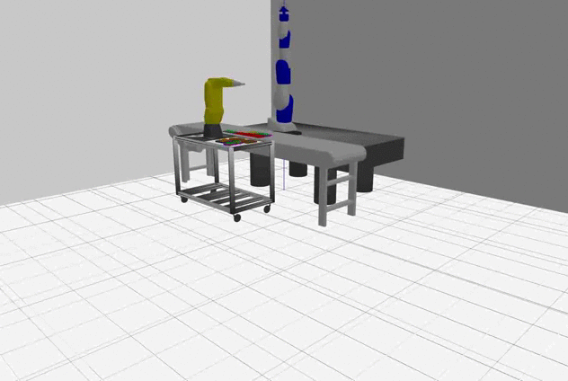

# GZAPRSROS

----

Please check out a branch appropriate to your Ubuntu OS version.

The repository contains code that uses Gazebo to do kitting simulation. 
The simulation environment is based on the Agility Lab setup at NIST.
There are 2 robots - a Fanuc LRMate and a Motoman sia200d that use gomotion
trajectory and serial kinematic modules. In addition, IKfast is used for the
Fanuc kinematics.

Below is an animated gif demonstration of the simulation.

Click here
[To see the Doxygen Documentation](https://usnistgov.github.io/gzaprsros)

