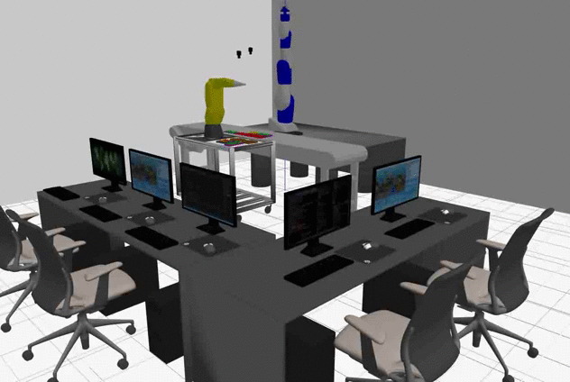

# GZAPRSROS

----

This gives a brief overview of how to install, build and run the ga(Gazebe) aprs (agility performane robot system) ros(robot operating system) code. It is open source with no copyright as it is government work.

# Requirements

Ubuntu and Platforms Tested:

(1)  Ubuntu 16.04.6 LTS

	> lsb_release -a

	No LSB modules are available.
	Distributor ID:	Ubuntu
	Description:	Ubuntu 16.04.6 LTS
	Release:	16.04
	Codename:	xenial
	> uname -a
	Linux 4.4.0-165-generic #193-Ubuntu SMP Tue Sep 17 17:42:52 UTC 2019 x86_64 x86_64 x86_64 GNU/Linux

And Linux installs for:

- Gazebo 9

- Ros I Kinetic

- gnu c++

and if compiling with QT Qt5.9.1 (as Qt 5.5 is VERY BUGGY on Ubuntu 16.04)

From: https://linuxhint.com/install-qt-5-9-1-qt-creator-4-3-1-ubuntu/

	wget http://download.qt.io/official_releases/qt/5.9/5.9.1/qt-opensource-linux-x64-5.9.1.run
	chmod +x qt-opensource-linux-x64-5.9.1.run
	./qt-opensource-linux-x64-5.9.1.run

# APRS Gazebo Build

.....  assuming cloned from github or gitlab

-- cd folder src/.. in your standard ROS package hierarchy layout to use catkin_make --

	> rosbuild.bash

There is a circular dependency of headers so one of the packages is run in isolation first, then all the packages are compile with cakint_build.

# RUNNING

APRS Gazebo Execution - TWO OPTIONS (a) and (b)

(a) "multi terminal"  

	a> bin9/agilitydemo.bash

(b) "ROS launch"

	b>  source devel/setup.bash
	b>  roslaunch gzrcs gzrcs_demo.launch 

but you must make sure gzserver is not running. No pkill in roslaunch. Instead:

	c> bin9/rosagilitydemo.bash

runs gazebo as a ROS subsystem to allow rqt, etc. to communicate with Gazebo using ROS communication or services.

# TESTING

We will assume option (a) has been chosen, and you should see this screen:

After running go into the aprs gz Motoman bash command line terminal and type 

	> auto

Likewise go into theaprs gz Fanuc  Fanuc bash command line terminal and type

	> auto

You should see both robot moving gears from trays to kits.

# DEBUGGING 

gzrcs demo:

1) start ROS: standalone_roscore.bash

2) start gazebo: standalone_agilitygazebo.bash

3) use QT to compile then run gzrcs in QT debugger

