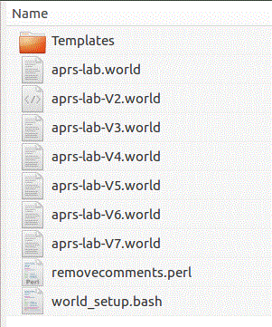
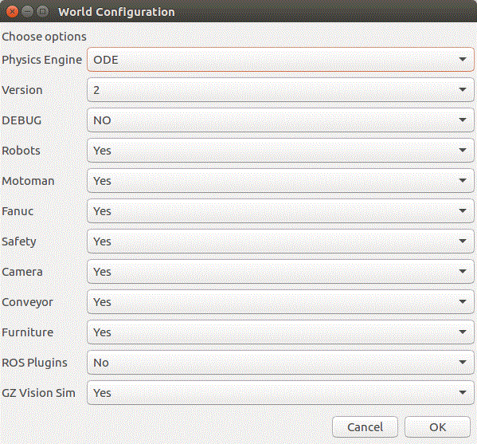
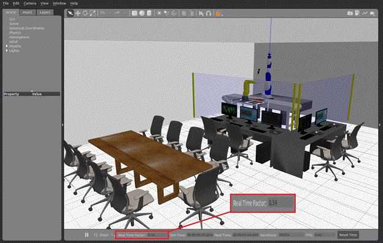

# Gazebo World Setup
----

This readme gives a brief overview of how to configure the gzaprsros World SDF file for Gazebo. Various models of the APRS laboratory are available, with configurable selections for versions, robots, kitting models, flags and the like.

Modelling in Gazebo is done with SDF. SDF is formalized XML to describe visualization, physics and control for objects in a simulated world. Object in the simulated world include robots, sensors and static or dynamic objects. The ability to communicate with these objects is enabled with the Gazebo message transport. The ability to extend SDF models is allowed through plugins
# Configuration



To configure the Gazebo world, navigate to the ./World folder. You should see the following APRS lab world SDF definitions, as well as the configuration bash script world_setup.bash.

Using the script engine bash, yad/zenity,  g++ preprocessor, a perl script, and templates, the SDF world can be customized to meet various simulation needs.  This assumes yad is installed, which in xenial requires:
	sudo apt-get install yad



We will assume g++ is already installed. The g++ preprocessor is used for #define value definitions that are embedded in the template SDF files to delineate conditional inclusions.  The template folder contains parts of the world with embedded preprocessor conditionals to factor in or out certain configurations. Then, the perl script removecomments.perl, which is part of the folder, is used to clear out the comments left behind by the g++ preprocessor. All these components are combined into the selected aprs version  to produce the aprs-lab.world  file used by the gzaprsros application.

Double click on the world_setup.bash file or invoke the world_setup.bash  script from the command line.  Once invoked you will get an simple yad GUI as shown in the figure below to configure the aprs-lab.world  file used by the gzaprsros application.



The breakdown of the various configuration variable in shown in the table below.


<TABLE>
<TR>
<TD>Variable </TD>
<TD>Description </TD>
</TR>
<TR>
<TD>Physics Engine </TD>
<TD>This selects the physics engine Gazebo will use. The default is ODE, but other options are available but through experimentation have been removed as they did not improve performance. </TD>
</TR>
<TR>
<TD>Version </TD>
<TD>There are 6 versions of the APRS lab to select from. Version 2 is a simple lightweight robot and kitting object model to lighten the simulation load on Gazebo. Version 6 can contain furniture, safety system, cameras, as part of the Gazebo world file. </TD>
</TR>
<TR>
<TD>Debug </TD>
<TD>The debug flag set to True will cause the Gazebo plugins to emit debugging messages. </TD>
</TR>
<TR>
<TD>Motoman </TD>
<TD>If True, the Motoman robot and assisted kitting models will be part of the world. </TD>
</TR>
<TR>
<TD>Fanuc </TD>
<TD>If True, the Fanuc robot and assisted kitting models will be part of the world. </TD>
</TR>
<TR>
<TD>Safety </TD>
<TD>If true, the safety curtain will be displayed. </TD>
</TR>
<TR>
<TD>Camera </TD>
<TD>If True, the cameras </TD>
</TR>
<TR>
<TD>Conveyor </TD>
<TD>If True, the conveyor model will be included in the model. </TD>
</TR>
<TR>
<TD>Furniture </TD>
<TD>If True, all the APRS lab furniture, PCs, monitors, etc. models will be included in the SDF world. </TD>
</TR>
<TR>
<TD>ROS Plugins </TD>
<TD>If true the gazebo-ros plugins for the conveyor, camera and safety system will be incorporated as part of the world SDF file. </TD>
</TR>
<TR>
<TD>Gz Vision Sim </TD>
<TD>If True, the vision simulator plugin will run which emits the Gazebo model for all kitting models on a given socket port (typically port 5002 but configurable). </TD>
</TR>
</TABLE>



One of the major considerations of the simulation fidelity is the processing load of the configured world. Many of the objects in the world are designated to be static to reduce physics calculations, which can degrade simulation. Such designated static objects include the kits and trays, chairs, tables, and PCs. Static objects do not incur any physics so that a static tray elevated to a fixed position in space will stay at this position (making the requirement for an underlying table moot). However, the placement of a "live" gear in a static tray will produce physics to detect and report collisions between the static tray and the dynamic gear, which is not computationally free. Below is a screenshot of Gazebo simulation with Version 6 Agility lab and the safety system (which includes 86 laser ROS plugins) resulting in a real-time factor shown at the bottom to be 0.34 which is quite computationally intensive especially when you consider that "nothing is being done".



So, an attempt was made to reduce the computational overhead by making objects such as trays and tables to be static to avoid the physics collision overhead. The configuration to make this simulation visualization is: 
	Version=6, Debug=0, Motoman=1, Fanuc=1, Safety=1, Camera=1, Conveyor=1, Furniture=1, ROS Plugins=1

Note, in order to communicate with the cameras and the safety system, the ROS Plugins must be true to allow communication to these sensors.

A quick summary of the APRS label model versions is given. Version 2 only has the robots, gears and trays, and does not include furniture nor camera sensors nor safety system as part of the World.  Thus, no matter if the furniture flag is true, the furniture will not be present in the simulation world. Version 6 has the robots, gears and trays, as well as the furniture, cameras, and safety system are part of the World. However, with Version 6 you can remove individual aspects (for example the furniture) so that the configuration flags are interpreted. Of note, version 2 was used extensively in grasping experimentation as the Gazebo simulation real-time factor is close to 1.0 so that simulation physics evaluation should be more accurate.
# Plugins

The Gazebo SDF world allows "plugin" to be embedded in a model to provide access to a model. In fact the same plugin can be used twice for different models in the world, but with different SDF/XML options so that the plugin acts differently. A plugin is code that is compiled as a shared library and inserted into the simulation as part of the SDF XML. The plugin has direct access to all the functionality of Gazebo through the standard C++ classes.
## gzjointcmdplugin

The gzjointcmdplugin plugin is used to control the joints of the robot model. It also reports the joint status values.  gzjointcmdplugin  is a custom  C++  gazebo plugin that uses a customized Gazebo/protobuf message.  The code for this plugin can be found at: src/gzplugins/gzjointcmdplugin. The files JointsComm.pb.{h,cc} were generated elsewhere using the Google protobuf compiler, and included in this plugin (and the client) for intercommunication with this plugin.

Below is the use of the plugin libgzjointcmdplugin to control a Fanuc robot "model" joints.
	<plugin filename="libgzjointcmdplugin.so" name="fanuc_jnts">
	<finger>fanuc_lrmate200id::fanuc_prism1</finger>
	<finger>fanuc_lrmate200id::fanuc_prism2</finger>
	<cmdtopic> ~/fanuc/robotcmd </cmdtopic>
	<statustopic> ~/fanuc/robotstatus </statustopic>
	<debug> 0 </debug>
	</plugin>

By changing the <cmdtopic> SDF/XML element, we can in fact use the same code to control the Motoman:
	<plugin filename="libgzjointcmdplugin.so" name="moto_jnts">
	    <cmdtopic> ~/motoman/robotcmd </cmdtopic>
	    <statustopic> ~/motoman/robotstatus </statustopic>
	    <finger>motoman_sia20d::motoman_right_finger_joint</finger>
	    <finger>motoman_sia20d::motoman_left_finger_joint</finger>
	    <debug> 0 </debug>
	</plugin>

There are some peculiarities to defining the a fully qualified joint name (e.g., a partial joint name is motoman_sia20d::motoman_right_finger_joint)  that will be omitted. So the libgzjointcmdplugin has 4 options: cmdtopic, statustopic, finger (multiple elements allowed) and debug. The cmdtopic is the Gazebo topic that a client advertised on that this plugin listens to receive joint updates. The plugin itself reads the robot model it is embedded in at startup to gather all the joints it will be updating. The <finger> option tells the plugin to ignore the finger joint for updating as this is handled elsewhere (in our case the libgzparallelgripperplugin).   YOU MUST INCLUDE THESE FINGERS, as the  libgzjointcmdplugin will attempt to update the fingers at the same time as the libgzparallelgripperplugin which will lead to oscillation of the finger joints (btween the commanded position of libgzparallelgripperplugin and zero as updated by libgzjointcmdplugin).
## gzparallelgripper 

The gzparallelgripper plugin is used to control the gripper joints of the robot model assuming the gripper is a disembodied parallel gripper (two fingers open/close).  The gzparallelgripper plugin monitors the pose error of a grasped object while the gripper is subject to various user-defined forces. The parallel gripper fingertips can be actuated using the GripCommand.pb.{h,cc} to accept (enabled/disabled) command which to send a close(true) or open(false) to actuate the gripper.  The plugin uses a simplified control scheme: a constant user-defined force is applied through both finger joints with a proportional corrective force used to maintain the symmetrical position of the gripper's fingertips. This scheme was used to better reflect the functionality of actual pneumatic grippers.

a gripper plugin SDF/XML example is shown below:
	<plugin name="ParallelGripperPlugin" filename="libgzparallelgripperplugin.so">
	<grip_force_close>5</grip_force_close>
	<joint1>motoman_sia20d::motoman_left_finger_joint</joint1>
	<joint2>motoman_sia20d::motoman_right_finger_joint</joint2>
	<grip_kp>10000</grip_kp>
	<control_topic> ~/gripper/motoman_sia20d/control  </control_topic>
	<state_topic> ~/gripper/motoman_sia20d/state  </state_topic>
	<debug> 0 </debug>
	<collisions> 1 </collisions>
	</plugin>

Where the <grip_force_close> defines the force to apply to fingers when closing. <joint1> and <joint2> specify the parallel finger joints Gazebo names. The <grip_kp> defines the proportional gain in the closing algorithm. The <control_topic> is a Gazebo topic name used to send customized Gazebo messages defining a enable/disable gripper commands. The <state_topic> is a Gazebo topic name used to report a customized Gazebo messages defining the state of the parallel gripper. The <collisions> flag enables the plugin to detect collisions between the finger links and an object, and to create/destroy a virtual joint between  the object and the gripper joint when closing/opening the gripper.  
