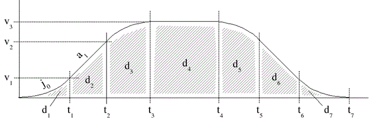
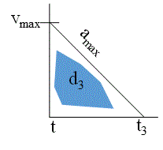
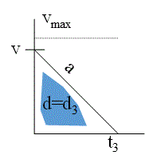
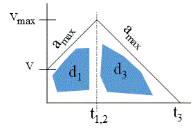
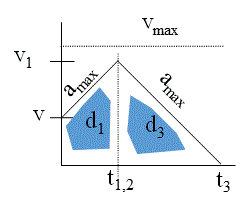
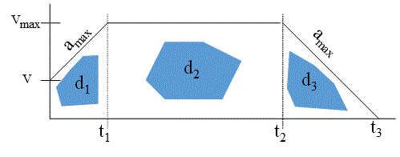
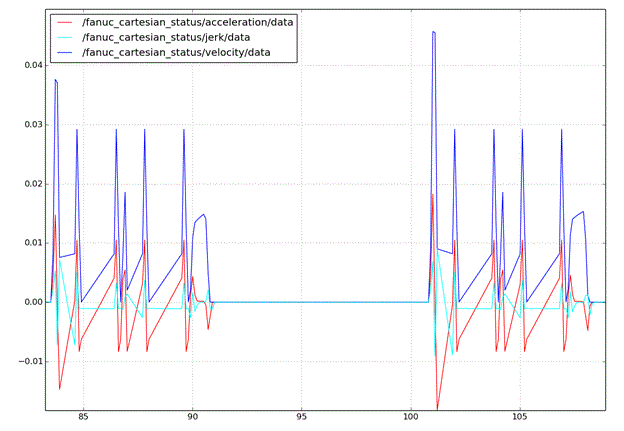
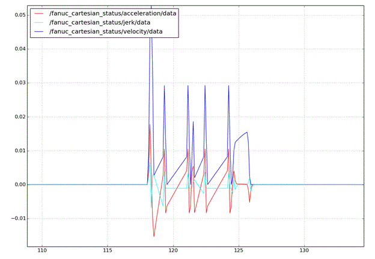
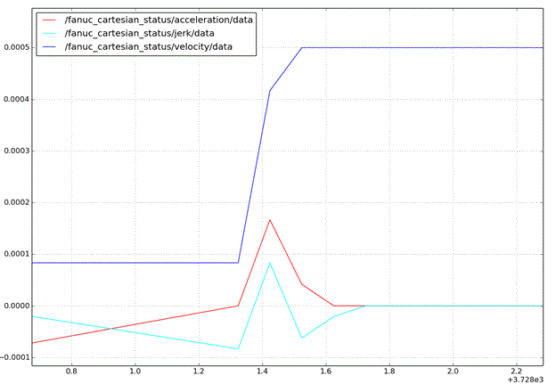

# Implementation of Gotraj as C++ and Python Package in ROS
----

Fred Proctor and John Michaloski

Friday, November 01, 2019

Gotraj.docx



This document discusses Robot Operating System (ROS) and the creation and use of Gomotion package to generate smooth Cartesian and joint trajectory motion.  Gomotion is a complete control system written in C/C++ that can run on Linux, Windows or real-time Linux. Of interest, is the trajectory component which handles kinematic robot motion through space. This trajectory element of gomotion was extracted and includes a posemath library that handles all the robot math data structures, some interpolation routines and finally the gotraj motion generator. Then, a C++ ROS package was developed that created a gotraj library with a ROS style front-end, using the tf data structures for pose, quaternion and vector. The back end of this package maps these ROS tf data structures into gomotion posemath, and calls the gotraj routines. If required, gomotion posemath results are translated back into ROS tf data structures before returning the results.  Thus, users familiar with ROS can use gotraj without an understanding of the underlying gotraj coding. Further, a ROS package that provides Python bindings has been developed and its creation is discussed at the end of the document.

Gotraj computes a smooth trajectory based on either time or dynamical properties (velocity, acceleration and jerk). Gotraj assumes a final velocity of zero.  Users can append poses onto the gotraj motion queue that will result in additional trajectories. Gotraj as well as the ROS package support "stop" motion directive that will generate a trajectory that will stop as soon as possible given the mtion dynamical properties (velocity, acceleration and jerk). It may be desirable to revise the dynamical motion properties if the robot is moving at an extremely slow speed.

NEED DIAGRAM.


## Gomotion Trajectory Planning Algorithms



As background, relevant trajectory terms will be given. A trajectory is the path of a robot arm through space. It is desirable that the motion is smooth and minimizes the wear and tear on the robot servos. A trajectory is based on a combination of dynamical properties to define the motion. These properties include (but are not limited to) velocity, acceleration, and jerk. Velocity describes the rate of change of the position (and orientation) of the robot, with respect to time. While acceleration is the rate of change of the velocity of the robot, again with respect to time.  Jerk is the rate of change of acceleration with respect to time, and as such is the second derivative of velocity, or the third derivative of position. Of note, robot velocity, acceleration and jerk can be categorized as pertaining to position, orientation, or a combination of both. Cruise is the case when the robot has zero acceleration and is travelling at a constant velocity.

Trajectory planning functions abbreviations used include:
- CV means constant velocity, CA means constant acceleration,
- CJ means constant jerk.



The Go Motion trajectory planning algorithms are based on smooth velocity profiling with bounded speed, acceleration and jerk, called "constant jerk" or "S-curve" velocity profiling. This gives smoother control than "trapezoidal" velocity profiling, which transitions instantaneously between acceleration and no acceleration and incurs spikes in unbounded jerk. 

Constant-jerk (CJ) profiling is shown in Figure 1, where a plot of the speed versus time is given. There are 7 phases to the motion- designated d1 through d7. The phases of motion behavior are defined as follows:


- Phase 1 (or d1) is a jerk phase, where the acceleration varies smoothly from 0 at time 0 to a1 at time t1 following the jerk (change in acceleration per unit time) j0. 
- Phase 2 (or d2) is an acceleration phase, with constant acceleration a1 throughout. 
- Phase 3 (or d3) is a jerk phase (or de-jerk phase) with constant (negative) jerk slowing down the acceleration from a1 to 0. 
- Phase 4 (or d4) is a constant speed phase at speed v3.
- Phase 5 (or d5) is a constant-jerk counterpart to phase 3, where the deceleration varies smoothly from 0 to -a1. 
- Phase 6 (or d6) is a constant-acceleration counterpart to phase 2. 
- Phase 7 (or d7) is a constant-jerk counterpart to phase 1, where the deceleration varies smoothly from -a1 to 0 and motion stops. 



**Figure 1 Constant jerk velocity profiling.**

However, often in robot motion planning, the robot never achieves all phases of trajectory motion described above. Instead, trajectories must conform to various distances, and dynamical trajectory properties. The next sections will cover various trajectory profiles and their calculations.
###  No Cruise or Acceleration

Assume the case where there are no cruise or acceleration phases in the trajectory motion and only a deceleration phase is required. This case is necessary when a trajectory "stop" is required. Figure 2 shows the case where the trajectory profile at the velocity maximum and requires decreasing the velocity by the acceleration maximum. Figure 2 shows the pure deceleration trajectory profile, assuming the robot has attained maximum velocity (i.e., Vmax ). 

**Figure 2 Deceleration only trajectory phase**

In the diagram, t is the current time, and t3 is three clock cycles in the future. d3 is phase. The term amax is clearly the acceleration maximum while vmax is the velocity maximum.

Assume d is the distance to travel. If    then no acceleration or cruise, and the following equation determines the distance traveled (d3): 

_ <𝑖𝑚𝑔 𝑠𝑟𝑐="ℎ𝑡𝑡𝑝𝑠://𝑙𝑎𝑡𝑒𝑥.𝑐𝑜𝑑𝑒𝑐𝑜𝑔𝑠.𝑐𝑜𝑚/𝑠𝑣𝑔.𝑙𝑎𝑡𝑒𝑥?_

_𝑑_

_3_

_=&𝑠𝑝𝑎𝑐𝑒;_

_1_

_2_

_&𝑠𝑝𝑎𝑐𝑒;∙_

_𝑡_

_3_

_&𝑠𝑝𝑎𝑐𝑒;∙_

_𝑣_

_𝑚𝑎𝑥_

_" 𝑡𝑖𝑡𝑙𝑒="_

_𝑑_

_3_

_=&𝑠𝑝𝑎𝑐𝑒;_

_1_

_2_

_&𝑠𝑝𝑎𝑐𝑒;∙_

_𝑡_

_3_

_&𝑠𝑝𝑎𝑐𝑒;∙_

_𝑣_

_𝑚𝑎𝑥_

"\ />\  	[1]

Which is equivalent to:

_ <𝑖𝑚𝑔 𝑠𝑟𝑐="ℎ𝑡𝑡𝑝𝑠://𝑙𝑎𝑡𝑒𝑥.𝑐𝑜𝑑𝑒𝑐𝑜𝑔𝑠.𝑐𝑜𝑚/𝑠𝑣𝑔.𝑙𝑎𝑡𝑒𝑥?_

_𝑑=𝑑_

_3_

_=&𝑠𝑝𝑎𝑐𝑒;&𝑠𝑝𝑎𝑐𝑒;_

__

__

_𝑣_

_2_

__

_𝑚𝑎𝑥_

__

__

_2∙𝑎_

_𝑚𝑎𝑥_

__

_" 𝑡𝑖𝑡𝑙𝑒="_

_𝑑=𝑑_

_3_

_=&𝑠𝑝𝑎𝑐𝑒;&𝑠𝑝𝑎𝑐𝑒;_

__

__

_𝑣_

_2_

__

_𝑚𝑎𝑥_

__

__

_2∙𝑎_

_𝑚𝑎𝑥_

__

"\ />\ 	[2]

The equation [2] is over constrained with d, v, a so relax a, which gives

**Figure 3 Deceleration only trajectory phase relaxed parameters**

_ <𝑖𝑚𝑔 𝑠𝑟𝑐="ℎ𝑡𝑡𝑝𝑠://𝑙𝑎𝑡𝑒𝑥.𝑐𝑜𝑑𝑒𝑐𝑜𝑔𝑠.𝑐𝑜𝑚/𝑠𝑣𝑔.𝑙𝑎𝑡𝑒𝑥?_

_1_

_2_

_∙&𝑠𝑝𝑎𝑐𝑒;_

_𝑡_

_3_

_&𝑠𝑝𝑎𝑐𝑒;∙𝑣=𝑑&𝑠𝑝𝑎𝑐𝑒;→_

_𝑡_

_3_

_&𝑠𝑝𝑎𝑐𝑒;=_

_2𝑑_

_𝑣_

_" 𝑡𝑖𝑡𝑙𝑒="_

_1_

_2_

_∙&𝑠𝑝𝑎𝑐𝑒;_

_𝑡_

_3_

_&𝑠𝑝𝑎𝑐𝑒;∙𝑣=𝑑&𝑠𝑝𝑎𝑐𝑒;→_

_𝑡_

_3_

_&𝑠𝑝𝑎𝑐𝑒;=_

_2𝑑_

_𝑣_

"\ />\ 	[3]



t

3

&space;→&space;&space;a=

v

t

" title="&space;v=a∙

t

3

&space;→&space;&space;a=

v

t

" />	[4]

Summarizing the trajectory profile for the case of No Cruise or Acceleration, we find motion parameters as follows:

 \ 

_𝑡_

_1_

__

_=𝑡_

_2_

_=0" 𝑡𝑖𝑡𝑙𝑒="_

_𝑡_

_1_

__

_=𝑡_

_2_

=0"\ />\ 	[5]  \ 

_𝑑_

_𝑡1_

_=_

_𝑑_

_𝑡2_

_=0" 𝑡𝑖𝑡𝑙𝑒="_

_𝑑_

_𝑡1_

_=_

_𝑑_

_𝑡2_

=0"\ />\ 	  \ 

_𝑡_

_3_

_=_

_2𝑑_

_𝑣_

_" 𝑡𝑖𝑡𝑙𝑒="_

_𝑡_

_3_

_=_

_2𝑑_

_𝑣_

"\ />\ 	   

a

max

=

v



t

3



" title="→

a

max

=

v



t

3



" />	

###  No Cruise 

In this case, the robot may accelerate to attain the maximum velocity, but never coasts along at a constant velocity. The robot is either accelerating or decelerating.

**Figure 4 No cruise trajectory**

The case of no cruise trajectory occurs when      as shown in Figure 4. The calculations for this trajectory case are:
<TABLE>
<TR>
<TD>  a max =&space; v max   " title="v+  a max =&space; v max   " /> 𝑡 1 = (𝑣 𝑚𝑎𝑥 −𝑣)/ 𝑎 𝑚𝑎𝑥 " 𝑡𝑖𝑡𝑙𝑒=" 𝑡 1 = (𝑣 𝑚𝑎𝑥 −𝑣)/ 𝑎 𝑚𝑎𝑥 "\ />\ \ 𝑑 1 =&𝑠𝑝𝑎𝑐𝑒; 𝑡 1 ∙ 𝑣+ 𝑣 𝑚𝑎𝑥  ∙ 1 2 " 𝑡𝑖𝑡𝑙𝑒=" 𝑑 1 =&𝑠𝑝𝑎𝑐𝑒; 𝑡 1 ∙ 𝑣+ 𝑣 𝑚𝑎𝑥  ∙ 1 2 "\ />\  1 2 ∙ (v max +v) (v max -v)/&space; a max " title="&space;&space;&space;&space;&space;=&space;&space; 1 2 ∙ (v max +v) (v max -v)/&space; a max " />  </TD>
<TD> <𝑖𝑚𝑔 𝑠𝑟𝑐="ℎ𝑡𝑡𝑝𝑠://𝑙𝑎𝑡𝑒𝑥.𝑐𝑜𝑑𝑒𝑐𝑜𝑔𝑠.𝑐𝑜𝑚/𝑠𝑣𝑔.𝑙𝑎𝑡𝑒𝑥? 𝑡 2,3  &𝑠𝑝𝑎𝑐𝑒;&𝑠𝑝𝑎𝑐𝑒;&𝑠𝑝𝑎𝑐𝑒;&𝑠𝑝𝑎𝑐𝑒;=𝑡 3  −𝑡 1 &𝑠𝑝𝑎𝑐𝑒;𝑎𝑛𝑑&𝑠𝑝𝑎𝑐𝑒;  𝑡 2 = 𝑡 1  " 𝑡𝑖𝑡𝑙𝑒=" 𝑡 2,3  &𝑠𝑝𝑎𝑐𝑒;&𝑠𝑝𝑎𝑐𝑒;&𝑠𝑝𝑎𝑐𝑒;&𝑠𝑝𝑎𝑐𝑒;=𝑡 3  −𝑡 1 &𝑠𝑝𝑎𝑐𝑒;𝑎𝑛𝑑&𝑠𝑝𝑎𝑐𝑒;  𝑡 2 = 𝑡 1  "\ />\ \ 𝑣 𝑚𝑎𝑥 =&𝑠𝑝𝑎𝑐𝑒; 𝑎 𝑚𝑎𝑥 ∙ 𝑡 2,3 " 𝑡𝑖𝑡𝑙𝑒=" 𝑣 𝑚𝑎𝑥 =&𝑠𝑝𝑎𝑐𝑒; 𝑎 𝑚𝑎𝑥 ∙ 𝑡 2,3 "\ />\ \ 𝑡 2,3 &𝑠𝑝𝑎𝑐𝑒;&𝑠𝑝𝑎𝑐𝑒;&𝑠𝑝𝑎𝑐𝑒;=  𝑣 𝑚𝑎𝑥   𝑎 𝑚𝑎𝑥  " 𝑡𝑖𝑡𝑙𝑒=" 𝑡 2,3 &𝑠𝑝𝑎𝑐𝑒;&𝑠𝑝𝑎𝑐𝑒;&𝑠𝑝𝑎𝑐𝑒;=  𝑣 𝑚𝑎𝑥   𝑎 𝑚𝑎𝑥  "\ />\ \ 𝑑 2 &𝑠𝑝𝑎𝑐𝑒;&𝑠𝑝𝑎𝑐𝑒;&𝑠𝑝𝑎𝑐𝑒;&𝑠𝑝𝑎𝑐𝑒;=&𝑠𝑝𝑎𝑐𝑒; 1 2 &𝑠𝑝𝑎𝑐𝑒;∙ 𝑡 2,3 ∙&𝑠𝑝𝑎𝑐𝑒; 𝑣 𝑚𝑎𝑥 " 𝑡𝑖𝑡𝑙𝑒=" 𝑑 2 &𝑠𝑝𝑎𝑐𝑒;&𝑠𝑝𝑎𝑐𝑒;&𝑠𝑝𝑎𝑐𝑒;&𝑠𝑝𝑎𝑐𝑒;=&𝑠𝑝𝑎𝑐𝑒; 1 2 &𝑠𝑝𝑎𝑐𝑒;∙ 𝑡 2,3 ∙&𝑠𝑝𝑎𝑐𝑒; 𝑣 𝑚𝑎𝑥 "\ />\  1 2 &space;∙ v max ∙ a max " title="&space;&space;&space;&space;&space;&space;&space;&space;&space;&space;=&space;&space; 1 2 &space;∙ v max ∙ a max " />  </TD>
</TR>
</TABLE>



_ <𝑖𝑚𝑔 𝑠𝑟𝑐="ℎ𝑡𝑡𝑝𝑠://𝑙𝑎𝑡𝑒𝑥.𝑐𝑜𝑑𝑒𝑐𝑜𝑔𝑠.𝑐𝑜𝑚/𝑠𝑣𝑔.𝑙𝑎𝑡𝑒𝑥?_

_𝑑_

_1_

_+_

_𝑑_

_2_

_=_

_&𝑠𝑝𝑎𝑐𝑒;_

__

__

_𝑉_

_𝑚𝑎𝑥_

__

_2_

__

__

_−&𝑠𝑝𝑎𝑐𝑒;_

_𝑣_

_2_

__

_2∙_

_𝑎_

_𝑚𝑎𝑥_

__

_+_

_&𝑠𝑝𝑎𝑐𝑒;_

__

_𝑉_

_𝑚𝑎𝑥_

__

_2_

__

_2∙_

_𝑎_

_𝑚𝑎𝑥_

__

_=&𝑠𝑝𝑎𝑐𝑒;_

_&𝑠𝑝𝑎𝑐𝑒;2∙&𝑠𝑝𝑎𝑐𝑒;_

__

__

_𝑉_

_𝑚𝑎𝑥_

__

_2_

__

__

_−&𝑠𝑝𝑎𝑐𝑒;_

_𝑣_

_2_

__

_2∙_

_𝑎_

_𝑚𝑎𝑥_

__

_&𝑠𝑝𝑎𝑐𝑒;" 𝑡𝑖𝑡𝑙𝑒="_

_𝑑_

_1_

_+_

_𝑑_

_2_

_=_

_&𝑠𝑝𝑎𝑐𝑒;_

__

__

_𝑉_

_𝑚𝑎𝑥_

__

_2_

__

__

_−&𝑠𝑝𝑎𝑐𝑒;_

_𝑣_

_2_

__

_2∙_

_𝑎_

_𝑚𝑎𝑥_

__

_+_

_&𝑠𝑝𝑎𝑐𝑒;_

__

_𝑉_

_𝑚𝑎𝑥_

__

_2_

__

_2∙_

_𝑎_

_𝑚𝑎𝑥_

__

_=&𝑠𝑝𝑎𝑐𝑒;_

_&𝑠𝑝𝑎𝑐𝑒;2∙&𝑠𝑝𝑎𝑐𝑒;_

__

__

_𝑉_

_𝑚𝑎𝑥_

__

_2_

__

__

_−&𝑠𝑝𝑎𝑐𝑒;_

_𝑣_

_2_

__

_2∙_

_𝑎_

_𝑚𝑎𝑥_

__

&space;"\ />\ 	[6]

If   then no cruise is required in the trajectory. The trajectory can then be recalculated      and    pictorially given by: 

giving:


<TABLE>
<TR>
<TD>  a max ∙ t 1 =&space; v 1   " title="v+  a max ∙ t 1 =&space; v 1   " /> 𝑑 1 =&𝑠𝑝𝑎𝑐𝑒; 𝑡 1 ∙(𝑣+𝑣+ 𝑎 𝑚𝑎𝑥 )/2" 𝑡𝑖𝑡𝑙𝑒=" 𝑑 1 =&𝑠𝑝𝑎𝑐𝑒; 𝑡 1 ∙(𝑣+𝑣+ 𝑎 𝑚𝑎𝑥 )/2"\ />\  </TD>
<TD> <𝑖𝑚𝑔 𝑠𝑟𝑐="ℎ𝑡𝑡𝑝𝑠://𝑙𝑎𝑡𝑒𝑥.𝑐𝑜𝑑𝑒𝑐𝑜𝑔𝑠.𝑐𝑜𝑚/𝑠𝑣𝑔.𝑙𝑎𝑡𝑒𝑥? 𝑡 2,3  &𝑠𝑝𝑎𝑐𝑒;&𝑠𝑝𝑎𝑐𝑒;&𝑠𝑝𝑎𝑐𝑒;&𝑠𝑝𝑎𝑐𝑒;=𝑡 3  −𝑡 1 &𝑠𝑝𝑎𝑐𝑒;𝑎𝑛𝑑&𝑠𝑝𝑎𝑐𝑒;  𝑡 2 = 𝑡 1  " 𝑡𝑖𝑡𝑙𝑒=" 𝑡 2,3  &𝑠𝑝𝑎𝑐𝑒;&𝑠𝑝𝑎𝑐𝑒;&𝑠𝑝𝑎𝑐𝑒;&𝑠𝑝𝑎𝑐𝑒;=𝑡 3  −𝑡 1 &𝑠𝑝𝑎𝑐𝑒;𝑎𝑛𝑑&𝑠𝑝𝑎𝑐𝑒;  𝑡 2 = 𝑡 1  "\ />\ \ 𝑣 𝑚𝑎𝑥 =&𝑠𝑝𝑎𝑐𝑒; 𝑎 𝑚𝑎𝑥 ∙ 𝑡 2,3 " 𝑡𝑖𝑡𝑙𝑒=" 𝑣 𝑚𝑎𝑥 =&𝑠𝑝𝑎𝑐𝑒; 𝑎 𝑚𝑎𝑥 ∙ 𝑡 2,3 "\ />\ \ 𝑡 2,3 &𝑠𝑝𝑎𝑐𝑒;&𝑠𝑝𝑎𝑐𝑒;&𝑠𝑝𝑎𝑐𝑒;=  𝑣 𝑚𝑎𝑥   𝑎 𝑚𝑎𝑥  " 𝑡𝑖𝑡𝑙𝑒=" 𝑡 2,3 &𝑠𝑝𝑎𝑐𝑒;&𝑠𝑝𝑎𝑐𝑒;&𝑠𝑝𝑎𝑐𝑒;=  𝑣 𝑚𝑎𝑥   𝑎 𝑚𝑎𝑥  "\ />\ \ 𝑑 2 &𝑠𝑝𝑎𝑐𝑒;&𝑠𝑝𝑎𝑐𝑒;&𝑠𝑝𝑎𝑐𝑒;&𝑠𝑝𝑎𝑐𝑒;=&𝑠𝑝𝑎𝑐𝑒; 1 2 &𝑠𝑝𝑎𝑐𝑒;∙  𝑣 1   𝑎 𝑚𝑎𝑥  ∙&𝑠𝑝𝑎𝑐𝑒; 𝑣 1 " 𝑡𝑖𝑡𝑙𝑒=" 𝑑 2 &𝑠𝑝𝑎𝑐𝑒;&𝑠𝑝𝑎𝑐𝑒;&𝑠𝑝𝑎𝑐𝑒;&𝑠𝑝𝑎𝑐𝑒;=&𝑠𝑝𝑎𝑐𝑒; 1 2 &𝑠𝑝𝑎𝑐𝑒;∙  𝑣 1   𝑎 𝑚𝑎𝑥  ∙&𝑠𝑝𝑎𝑐𝑒; 𝑣 1 "\ />\    v 1  2  2 a max  " title="&space;&space;&space;&space;&space;&space;&space;&space;&space;&space;=&space;&space;&space;   v 1  2  2 a max  " />    v+&space; a max   2  2∙&space; a max  " title="&space;&space;&space;&space;&space;&space;&space;&space;&space;=   v+&space; a max   2  2∙&space; a max  " />  </TD>
</TR>
</TABLE>

d

1

+

d

2

" title="d=&space;

d

1

+

d

2

" />	[7]   

2&space;v&space;

t

1

+&space;

a

max∙





t

1



2



2

+



v

2



a

max



t

1

+



a

2



max

∙



t

1



2



2

a

max



" title="&space;&space;&space;=

2&space;v&space;

t

1

+&space;

a

max∙





t

1



2



2

+



v

2



a

max



t

1

+



a

2



max

∙



t

1



2



2

a

max



" />	   

a

max

d=2v

a

max



t

1

+

&space;



a

2



max









t

1



2

" title="2

a

max

d=2v

a

max



t

1

+

&space;



a

2



max









t

1



2

" />	  \ 

_&𝑠𝑝𝑎𝑐𝑒;0&𝑠𝑝𝑎𝑐𝑒;&𝑠𝑝𝑎𝑐𝑒;&𝑠𝑝𝑎𝑐𝑒;=&𝑠𝑝𝑎𝑐𝑒;2_

__

_𝑎_

_2_

__

_𝑚𝑎𝑥_

__

__

__

__

_𝑡_

_1_

__

_2_

_+&𝑠𝑝𝑎𝑐𝑒;4𝑣_

_𝑎_

_𝑚𝑎𝑥_

_&𝑠𝑝𝑎𝑐𝑒;_

_𝑡_

_1_

_+&𝑠𝑝𝑎𝑐𝑒;_

_𝑣_

_2_

_−2_

_𝑎_

_𝑚𝑎𝑥_

_" 𝑡𝑖𝑡𝑙𝑒="_

_&𝑠𝑝𝑎𝑐𝑒;0&𝑠𝑝𝑎𝑐𝑒;&𝑠𝑝𝑎𝑐𝑒;&𝑠𝑝𝑎𝑐𝑒;=&𝑠𝑝𝑎𝑐𝑒;2_

__

_𝑎_

_2_

__

_𝑚𝑎𝑥_

__

__

__

__

_𝑡_

_1_

__

_2_

_+&𝑠𝑝𝑎𝑐𝑒;4𝑣_

_𝑎_

_𝑚𝑎𝑥_

_&𝑠𝑝𝑎𝑐𝑒;_

_𝑡_

_1_

_+&𝑠𝑝𝑎𝑐𝑒;_

_𝑣_

_2_

_−2_

_𝑎_

_𝑚𝑎𝑥_

"\ />\ 	   

t

1

&space;&space;=&space;&space;&space;



16

&space;v

2





a

2



max

&space;

t

1

-4

2



a

2



max







v

3

-2

a

max

d





4&space;



a

2



max



" title="&space;

t

1

&space;&space;=&space;&space;&space;



16

&space;v

2





a

2



max

&space;

t

1

-4

2



a

2



max







v

3

-2

a

max

d





4&space;



a

2



max



" />	   

-4v

a

max

&space;±&space;2a&space;

2&space;



v

2

+2ad





4&space;



a

2



max



" title="&space;&space;&space;&space;&space;&space;&space;=&space;-&space;&space;

-4v

a

max

&space;±&space;2a&space;

2&space;



v

2

+2ad





4&space;



a

2



max



" />	   

-4v

a

max

&space;±4

a

max

&space;



1

2





v

2

+2ad





4&space;



a

2



max



" title="&space;&space;&space;&space;&space;=&space;&space;&space;

-4v

a

max

&space;±4

a

max

&space;



1

2





v

2

+2ad





4&space;



a

2



max



" />	  \ 

_𝑡_

_1_

_=_

_−𝑣&𝑠𝑝𝑎𝑐𝑒;±&𝑠𝑝𝑎𝑐𝑒;_

__

_1_

_2_

__

__

_𝑣_

_2_

_+2𝑎𝑑_

__

__

__

_𝑎_

_𝑚𝑎𝑥_

__

_" 𝑡𝑖𝑡𝑙𝑒="_

_𝑡_

_1_

_=_

_−𝑣&𝑠𝑝𝑎𝑐𝑒;±&𝑠𝑝𝑎𝑐𝑒;_

__

_1_

_2_

__

__

_𝑣_

_2_

_+2𝑎𝑑_

__

__

__

_𝑎_

_𝑚𝑎𝑥_

__

"\ />\ 	  \ 

_&𝑠𝑝𝑎𝑐𝑒;𝑡_

_3&𝑠𝑝𝑎𝑐𝑒;_

_=&𝑠𝑝𝑎𝑐𝑒;_

_&𝑠𝑝𝑎𝑐𝑒;_

_𝑡_

_1_

_+&𝑠𝑝𝑎𝑐𝑒;𝑡_

_2,3_

__

_&𝑠𝑝𝑎𝑐𝑒;&𝑠𝑝𝑎𝑐𝑒;&𝑠𝑝𝑎𝑐𝑒;&𝑠𝑝𝑎𝑐𝑒;=𝑡_

_1_

_+_

__

_𝑣_

_1_

__

__

_𝑎_

_𝑚𝑎𝑥_

__

__

_&𝑠𝑝𝑎𝑐𝑒;&𝑠𝑝𝑎𝑐𝑒;&𝑠𝑝𝑎𝑐𝑒;&𝑠𝑝𝑎𝑐𝑒;=𝑡_

_1_

_+_

_𝑣&𝑠𝑝𝑎𝑐𝑒;+𝑎&𝑠𝑝𝑎𝑐𝑒;_

_𝑡_

_1_

_&𝑠𝑝𝑎𝑐𝑒;_

_𝑎_

_" 𝑡𝑖𝑡𝑙𝑒="_

_&𝑠𝑝𝑎𝑐𝑒;𝑡_

_3&𝑠𝑝𝑎𝑐𝑒;_

_=&𝑠𝑝𝑎𝑐𝑒;_

_&𝑠𝑝𝑎𝑐𝑒;_

_𝑡_

_1_

_+&𝑠𝑝𝑎𝑐𝑒;𝑡_

_2,3_

__

_&𝑠𝑝𝑎𝑐𝑒;&𝑠𝑝𝑎𝑐𝑒;&𝑠𝑝𝑎𝑐𝑒;&𝑠𝑝𝑎𝑐𝑒;=𝑡_

_1_

_+_

__

_𝑣_

_1_

__

__

_𝑎_

_𝑚𝑎𝑥_

__

__

_&𝑠𝑝𝑎𝑐𝑒;&𝑠𝑝𝑎𝑐𝑒;&𝑠𝑝𝑎𝑐𝑒;&𝑠𝑝𝑎𝑐𝑒;=𝑡_

_1_

_+_

_𝑣&𝑠𝑝𝑎𝑐𝑒;+𝑎&𝑠𝑝𝑎𝑐𝑒;_

_𝑡_

_1_

_&𝑠𝑝𝑎𝑐𝑒;_

_𝑎_

"\ />\ 	   

&space;dt

1&space;

=&space;





&space;2v+

a

max

&space;

t

1





2



&space;



t

1

" title="&space;

&space;dt

1&space;

=&space;





&space;2v+

a

max

&space;

t

1





2



&space;



t

1

" />	  





###  Cruise but not attaining maximum velocity

Otherwise there is a coast but the trajectory never attains the maximum velocity, and follows the following trajectory profile, outlined in the figure below:

The case of a trajectory not attaining maximum velocity occurs when d <     And this trajectory profile leads to the following calculations:

_ <𝑖𝑚𝑔 𝑠𝑟𝑐="ℎ𝑡𝑡𝑝𝑠://𝑙𝑎𝑡𝑒𝑥.𝑐𝑜𝑑𝑒𝑐𝑜𝑔𝑠.𝑐𝑜𝑚/𝑠𝑣𝑔.𝑙𝑎𝑡𝑒𝑥?_

_𝑡_

_1_

_=_

_(𝑣_

_𝑚𝑎𝑥_

_−𝑣)/_

_𝑎_

_𝑚𝑎𝑥_

_&𝑠𝑝𝑎𝑐𝑒;&𝑠𝑝𝑎𝑐𝑒;&𝑠𝑝𝑎𝑐𝑒;&𝑠𝑝𝑎𝑐𝑒;&𝑠𝑝𝑎𝑐𝑒;&𝑠𝑝𝑎𝑐𝑒;&𝑠𝑝𝑎𝑐𝑒;&𝑠𝑝𝑎𝑐𝑒;&𝑠𝑝𝑎𝑐𝑒;&𝑠𝑝𝑎𝑐𝑒;&𝑠𝑝𝑎𝑐𝑒;&𝑠𝑝𝑎𝑐𝑒;&𝑠𝑝𝑎𝑐𝑒;&𝑠𝑝𝑎𝑐𝑒;_

_𝑡_

_23_

_=_

_𝑣_

_𝑚𝑎𝑥_

_/_

_𝑎_

_𝑚𝑎𝑥_

_" 𝑡𝑖𝑡𝑙𝑒="_

_𝑡_

_1_

_=_

_(𝑣_

_𝑚𝑎𝑥_

_−𝑣)/_

_𝑎_

_𝑚𝑎𝑥_

_&𝑠𝑝𝑎𝑐𝑒;&𝑠𝑝𝑎𝑐𝑒;&𝑠𝑝𝑎𝑐𝑒;&𝑠𝑝𝑎𝑐𝑒;&𝑠𝑝𝑎𝑐𝑒;&𝑠𝑝𝑎𝑐𝑒;&𝑠𝑝𝑎𝑐𝑒;&𝑠𝑝𝑎𝑐𝑒;&𝑠𝑝𝑎𝑐𝑒;&𝑠𝑝𝑎𝑐𝑒;&𝑠𝑝𝑎𝑐𝑒;&𝑠𝑝𝑎𝑐𝑒;&𝑠𝑝𝑎𝑐𝑒;&𝑠𝑝𝑎𝑐𝑒;_

_𝑡_

_23_

_=_

_𝑣_

_𝑚𝑎𝑥_

_/_

_𝑎_

_𝑚𝑎𝑥_

"\ />\ 	[8]  \ 

_𝑑_

_1_

_=&𝑠𝑝𝑎𝑐𝑒;_

_𝑡_

_1_

_&𝑠𝑝𝑎𝑐𝑒;∙_

_1_

_2_

_𝑣+&𝑠𝑝𝑎𝑐𝑒;_

_𝑣_

_𝑚𝑎𝑥_

__

__

_" 𝑡𝑖𝑡𝑙𝑒="_

_𝑑_

_1_

_=&𝑠𝑝𝑎𝑐𝑒;_

_𝑡_

_1_

_&𝑠𝑝𝑎𝑐𝑒;∙_

_1_

_2_

_𝑣+&𝑠𝑝𝑎𝑐𝑒;_

_𝑣_

_𝑚𝑎𝑥_

__

__

"\ />\ 	  \ 

_𝑑_

_3_

_=_

_1_

_2_

__

_𝑡_

_23_

_&𝑠𝑝𝑎𝑐𝑒;∙_

_𝑣_

_𝑚𝑎𝑥_

_=_

_1_

_2_

_&𝑠𝑝𝑎𝑐𝑒;_

__

__

_𝑣_

_𝑚𝑎𝑥_

__

_2_

__

__

_𝑎_

_𝑚𝑎𝑥_

__

_" 𝑡𝑖𝑡𝑙𝑒="_

_𝑑_

_3_

_=_

_1_

_2_

__

_𝑡_

_23_

_&𝑠𝑝𝑎𝑐𝑒;∙_

_𝑣_

_𝑚𝑎𝑥_

_=_

_1_

_2_

_&𝑠𝑝𝑎𝑐𝑒;_

__

__

_𝑣_

_𝑚𝑎𝑥_

__

_2_

__

__

_𝑎_

_𝑚𝑎𝑥_

__

"\ />\ 	  \ 

_𝑑_

_2_

_&𝑠𝑝𝑎𝑐𝑒;=𝑑−&𝑠𝑝𝑎𝑐𝑒;_

_𝑑_

_1_

_−&𝑠𝑝𝑎𝑐𝑒;_

_𝑑_

_3_

_" 𝑡𝑖𝑡𝑙𝑒="_

_𝑑_

_2_

_&𝑠𝑝𝑎𝑐𝑒;=𝑑−&𝑠𝑝𝑎𝑐𝑒;_

_𝑑_

_1_

_−&𝑠𝑝𝑎𝑐𝑒;_

_𝑑_

_3_

"\ />\ 	  \ 

_𝑑_

_2_

_&𝑠𝑝𝑎𝑐𝑒;=_

_𝑡_

_12_

_∙_

_𝑣_

_𝑚𝑎𝑥_

_" 𝑡𝑖𝑡𝑙𝑒="_

_𝑑_

_2_

_&𝑠𝑝𝑎𝑐𝑒;=_

_𝑡_

_12_

_∙_

_𝑣_

_𝑚𝑎𝑥_

"\ />\ 	  \ 

_𝑡_

_12_

_=&𝑠𝑝𝑎𝑐𝑒;_

__

_𝑑_

_2_

__

__

_𝑣_

_𝑚𝑎𝑥_

__

_" 𝑡𝑖𝑡𝑙𝑒="_

_𝑡_

_12_

_=&𝑠𝑝𝑎𝑐𝑒;_

__

_𝑑_

_2_

__

__

_𝑣_

_𝑚𝑎𝑥_

__

"\ />\ 	  \ 

_𝑡_

_2_

_=&𝑠𝑝𝑎𝑐𝑒;_

_𝑡_

_1_

_−&𝑠𝑝𝑎𝑐𝑒;_

_𝑡_

_12_

_=&𝑠𝑝𝑎𝑐𝑒;_

_𝑡_

_1_

_+_

__

_𝑑_

_2_

__

__

_𝑣_

_𝑚𝑎𝑥_

__

_" 𝑡𝑖𝑡𝑙𝑒="_

_𝑡_

_2_

_=&𝑠𝑝𝑎𝑐𝑒;_

_𝑡_

_1_

_−&𝑠𝑝𝑎𝑐𝑒;_

_𝑡_

_12_

_=&𝑠𝑝𝑎𝑐𝑒;_

_𝑡_

_1_

_+_

__

_𝑑_

_2_

__

__

_𝑣_

_𝑚𝑎𝑥_

__

"\ />\ 	  \ 

_𝑡_

_3_

_=&𝑠𝑝𝑎𝑐𝑒;_

_𝑡_

_2_

_+_

__

_𝑣_

_𝑚𝑎𝑥_

__

__

_𝑎_

_𝑚𝑎𝑥&𝑠𝑝𝑎𝑐𝑒;_

__

_&𝑠𝑝𝑎𝑐𝑒;" 𝑡𝑖𝑡𝑙𝑒="_

_𝑡_

_3_

_=&𝑠𝑝𝑎𝑐𝑒;_

_𝑡_

_2_

_+_

__

_𝑣_

_𝑚𝑎𝑥_

__

__

_𝑎_

_𝑚𝑎𝑥&𝑠𝑝𝑎𝑐𝑒;_

__

&space;"\ />\ 	


# Cartesian Trajectory Messages

To verify the trajectory profile of the ROS gotraj package, plotting was desired. Unfortunately, Cartesian trajectory messages with position, velocity, acceleration and jerk specified were not available in ROS. So, first a Cartesian trajectory message set with acceleration and jerk was required. There is some ROS activity that has proposed a set of Cartesian trajectories (http://wiki.ros.org/robot_mechanism_controllers/Reviews/Cartesian%20Trajectory%20Proposal%20API%20Review) but nothing permanent has been created. Instead, the draft message constructs were used and a "cartesian_trajectory_msg" package was built that simply compiled the "msg" files into C++ header files. This was the only purpose of the cartesian_trajectory_msg package.  Five message files were coded:
	CartesianTrajectoryResult.msg
	CartesianTrajectoryGoal.msg
	CartesianTolerance.msg
	CartesianTrajectoryPoint.msg
	CartesianTrajectoryError.msg

The primary message file of interest was the CartesianTrajectoryPoint.msg since it contained velocity, acceleration and jerk fields that could be published and read by rqt_plot:
	#
	# CartesianTrajectoryPoint.msg
	#
	std_msgs/Duration time_from_start
	geometry_msgs/Pose pose
	geometry_msgs/Twist twist
	std_msgs/Float64[] posture
	std_msgs/Float64 velocity
	std_msgs/Float64 acceleration
	std_msgs/Float64 jerk

So, this message was filled out by the controller, based on the current and last robot motion state and the results were published.

The ROS command rostopic can be used to verify that the NIST controller publishes a Cartesian status topic for the Fanuc and the Motoman robots. You should see the name of the robot with an "_" prefixed to the "cartesian_status" topic name.  If you have ROS running you can do a rostopic list to verify this.
	> rostopic list
	/clicked_point
	/crcl_command
	/crcl_status
	/fanuc_cartesian_status
	/fanuc_crcl_command
	/fanuc_crcl_status
	/initialpose
	/joint_states
	/motoman_cartesian_status
	/motoman_crcl_command
	/motoman_crcl_status
	/move_base_simple/goal
	/nist_controller/robot/joint_states
	/rosout
	/rosout_agg
	/tf
	/tf_static
	/visualization_marker
	/visualization_marker_array



Once the topic fanuc_cartesian_status has been verified as existing, you can monitor the topic for traffic to verify that the controller is updating the Cartesian velocity, acceleration and jerk status within the topic. At the command line, with ROS and the controller running in another terminal, run "rostopic echo fanuc_cartesian_status" as a command and you should see a stream of Cartesian status. You are now ready to plot the Cartesian status data.
	>rostopic echo fanuc_cartesian_status
	. . . 
	velocity: 
	  data: 0.000134053950859
	acceleration: 
	  data: 6.7024994282e-05
	jerk: 
	  data: -4.51721361763e-05

  

ROS provides numerous utilities for debugging robot activities. The ROS rqt_plot was chosen since it reads ROS messages with potentially multiple fields and plots them in a graph. rqt_plot  also displays a scrolling time plot of the data published on topics.  So, the test ROS controller was modified.  Cartesian trajectory messages were added that provided a topics in which to publish the gotraj trajectory profile.  Once a Cartesian motion topic was available, the velocity, acceleration and jerk of Fanuc and Motoman robots were published (in ROS vernacular). To calculate these values, the current and last poses were used.  Velocity was calculated as the distance traveled divided by two. If no previous pose was available, zero was used. Likewise, acceleration was calculated by taking the current velocity minus the last velocity and dividing the result by two. Similarly, jerk was calculated.

A circular buffer of size one was kept to maintain the last velocity, acceleration, and jerk using the boost template circular buffer implementation http://www.boost.org/doc/libs/1_55_0/doc/html/circular_buffer/example.html. Both the status and the last status have the pose, but this only helps in calculating the velocity. So, a circular buffer as shown below was declared of size 1 (initialized at the Controller constructor).
	boost::circular_buffer<cartesian_trajectory_msg::CartesianTrajectoryPoint> profiles;



Below is the code to compute velocity, acceleration and jerk. Each of these values was computed since the gotraj motion planner supports smoothing based on jerk.  The declaration profile is the "cartesian_status" topic data structure. Of note, the std_msgs::Float64 is not a C++ data primitive.  In order to store a double into the velocity, acceleration and jerk message parts, each item must be further qualified by accessing its data element. So instead of a simple one-to-one assignment, you must assign a double to its data field, e.g., profile.acceleration.data= (double) 1.1; 
	tf::Pose &lastpose(laststatus.currentpose); 
	//  current robot pose 
	status.currentpose = Kinematics()->FK(status.currentjoints.position); 
	// compute Cartesian vel, acc, jerk
	cartesian_trajectory_msg::CartesianTrajectoryPoint profile;
	// Compute vel, acc, jerk based on position.
	// This doesn't include angular velocity calculation - assume approx same as linear
	// Fill & publish cartesian_status message (assume other message elements already set)
	profile.velocity.data= (status.currentpose.getOrigin().distance(lastpose.getOrigin())) / 2.0;
	double lastvel = (profiles.size() > 0) ? profiles[0].velocity.data : 0.0;
	double lastacc = (profiles.size() > 0) ? profiles[0].acceleration.data : 0.0;
	profile.acceleration.data = (fabs(profile.velocity.data) - fabs(lastvel)) / 2.0;
	profile.jerk.data = (fabs(profile.acceleration.data) - fabs(lastacc)) / 2.0;
	// Save profile in circular buffer
	profiles.push_back(profile);
	// publish cartesian_status message assume topic has prepended robot name 
	cartesian_status.publish(profile);

 

To run the rqt_plot at a terminal console with ROS and the NIST controller running type:
	 > rqt_plot /fanuc_cartesian_status/velocity:acceleration:jerk

 

which listens to the published velocity/acceleration/jerk values published by the Fanuc LR mate controller. You have to play with the display to see anything, since the velocity/acceleration/jerk are small. It is suggested to use the last button on the right (the check mark) and change x to run from 0 to 1000.  

Then you can use the fourth button (zoom) which allows you to draw crosshairs that can select a range of the plot to zoom in on (from 80-110) or 30 time units. The x axis is the time sequence. This can be done since the profile will be a visible blip, but might be small. Just zoom in, and you should see the vel/acc/jerk profile.  It was not evident in the plots, but the motions were relatively short compared to the maximum vel distance, so the smooth ramping was not evident.

The motion sequence is evident in the plot: first, the robot approaches an object, then the robot descends to the object, grasps the object, and retracts to a safe distance, and then makes the object move: approach, descend, release the object, and depart. Finally, a coordinated joint move to a programmed "safe" robot position is performed. The last joint move has slower max profile so the plot is flatter with an actual hump.





Then, the plot is zoomed again, 110-130, that is 20 total time units.




## Adjusting the Cartesian Trajectory Parameters

The configuration of the Cartesian trajectory profile encompasses setting the maximum linear velocity, acceleration and jerk as well as the maximum rotational velocity, acceleration and jerk. This capability can be adjusted easily within the ini file associated with the controllers. For each controller section tag, it must have a parameter tag that defines a std::vector of three values.

The Cartesian trajectory parameters are set in an ini file that is read upon startup by the controller each time. The ini file has several sections which are lines that have the section enclosed in brackets, e.g.., [Section]. The file location of the configuration ini file is under the config folder of the nist_robotsnc ROS package under the nistfanuc_ws workspace (i.e., .../nistfanuc_ws/src/nist_robotsnc/config/nist_robotsnc.ini). Inside the ini file, is a section {fanuc_] that describes the Fanuc LR Mate 200 id robot. Included in this are the "linearmax" and the"rotationmax" tags which control the ramping profile of the gotraj motion trajectory. 
	[fanuc_]
	longname=FanucLRMate200iD
	prefix=fanuc_
	. . .
	linearmax=0.01, 0.1, 1
	rotationmax=.1, 1.0, 10.0

In the previous section, the  linear max trajectory parameters were 
	linearmax=1.0,10., 100.0
	rotationmax=.1, 1.0, 10.0

and this gave a very   with no coasting, and not reaching the velocity maximum.  Using the slower trajectory profile parameters
	linearmax=0.01, 0.1, 1
	rotationmax=.1, 1.0, 10.0

one can see a slower ramping acceleration and deceleration, in fact, the ramping is so slow that an entire coasting profile cannot be graphed, and instead a portion where the transition activity is shown:

The ini file parameters are read by the robot control system (RCS) interpreter, which queries the gotraj routines for path updates. When there are no more path updates on the gotraj motion queue, the motion has completed.  Below is the code that when if finds a new Cartesian move command, initializes the gotraj pose generator with the current pose (curpose) and goal pose (finalpose) and supplies the motion parameters as supplied by the ini file: e.g., _nc->linearmax ()[0], where the maximum velocity is in array position 0, acceleration is in array position 1, and jerk is in array position 2.
	        if (cmd.CommandNum() != _lastcmdid) {
	            _lastcmdid = cmd.CommandNum();
	            _go->InitPose(curpose,
	                    finalpose,
	                    gomotion::GoTrajParams(_nc->linearmax()[0],
	                    _nc->linearmax()[1],
	                    _nc->linearmax()[2]),
	                    gomotion::GoTrajParams(_nc->rotationmax()[0],
	                    _nc->rotationmax()[1],
	                    _nc->rotationmax()[2])); // 1 meter/sec
	        }

Then each cycle (including the first one that did the InitPose above, a new pose is calculated:
	        tf::Pose gopose =  _go->NextPose() ;
	        tf::Pose nextpose = _nc->invBasePose() * gopose * _nc->invGripperPose();

Then the gotraj library is queried to see if it is done with this trajectory sequence (could have several waypoints appended to the motion queue). The IsDone() method is calls the gotraj motion queue, and if it's done returns true.
	       if (_go->IsDone())
	            return CanonStatusType::CANON_DONE;
	        else
	            return CanonStatusType::CANON_WORKING;



The gotraj trajectory generator can generate code for joint or Cartesian motion. However, it assumes that one user per instance is commanding the gotraj routine. That is, unpredictable behavior would result if multiple threads attempted to perform a NextPose on the same gotraj object.
# Gotraj Python Bindings

This section briefly covers the creation of a Python binding for a ROS C++ package. It uses straight boost Python library as opposed to Py++ or SIP or SWIG or Pybind11.  The reason boost Python library was selected was that ROS uses it in moveit!! and has a tutorial on it, called "Using a C++ class in Python". The tutorial can be found at:

http://wiki.ros.org/ROS/Tutorials/Using%20a%20C%2B%2B%20class%20in%20Python 

To get Python binding from the ROS C++ code, we use boost::python, which does a lot of magic under the hood. (There is still a lot of magic left undocumented!) It is important to be familiar with boost::python. This is a good tutorial to get started:

http://boost.cppll.jp/HEAD/libs/python/doc/tutorial/  and

https://wiki.python.org/moin/boost.python



Other potentially helpful web sites are spelled out in the appendix.
## 1. Create a new catkin package 

To make matters clean, separate the ROS C++ pacakge from the ROS python bindings to the ROS C++ pacakge. In oder to do this first create a new ROS catkin package.  Configuring the package.xml and the CmakeLists.txt will be covered later.
## 2. Create cpp source file to hold C++ boost python code

Next you will need to implement a boost/python binding to your ROS C++. So you will need to include the boost python header (which does the heavy binding lifting) and your ROS package header. The fundamental Python module definition is done with the macro BOOST_PYTHON_MODULE(rospackage_python) whose name "rospackage_python"  must match your eventual ROS package name!


	#include <boost/python.hpp>
	#include <urrospackage/PkgMainHeader.h>
	BOOST_PYTHON_MODULE(rospackage_python) {
	  
	}

The important things to note about this file: 
1. The module file is the entry point for a boost::python module. There should only be one call to BOOST_PYTHON_MODULE() within any single library and this should call functions that export all the pieces of your python package.
2. The library name in the BOOST_PYTHON_MODULE() call must match the name of the library produced by building your code in C++. This name must match exactly or the python import statement will fail. Of course, it can fail for other reasons!
## 3. Implement python bindings

Inside of the module.cpp file you will need to implement bindings to your ROS C++ API.  For simple types, for example, integer, double Boolean, the boost python library will handle the conversion. Ironically, more complicated data structures may require conversion between Python "objects" and C++ classes/struct. Most examples showed C++ API with doubles. More common, a Python "list" must be mapped into and out of a std::vector structure. Thus, depending on the list type, you will need to convert to the appropriate template type.  It is not obvious from the tutorial on the C++ Python bindings  

Below are some links that have C++ code to assist in the C++ Python type conversion problem. 

This website in particular enlighten me to the C++ Python type conversion:

http://shitohichiumaya.blogspot.com/2010/08/boostpython-how-to-pass-python-object.html




## 4. Create the python __init__.py  and setup.py file

The following describes the implementation for the gotrajcommander ROS package.

This is how I laid out my ROS package for the python bindings of gotraj.  It was a normal package in that the src and include/gotrajcommander folders contained C++ header and source files. The python/gotrajcommander contained an __init__.py. The setup.py was in the gotrajcommander folder.
	gotrajcommander:
	├───src
	├───scripts
	├───python
	│   └───gotrajcommander
	└───include
	    └───gotrajcommander



To import the gotrajcommander library into python, we need a proper python module: a directory with an __init__.py file. By convention, we put these in
	 ROSworkspace/src/gotrajcommander/python/gotrajcommander. 

Whatever name you use here, this is what people will have to use when they call import in python. So, in this case, people will have to type import gotrajcommander.



The init file must import all the c++ bindings.

The setup.py file followed the directions from the ROS tutorial ( http://wiki.ros.org/ROS/Tutorials/Using%20a%20C%2B%2B%20class%20in%20Python ):
	from distutils.core import setup
	from catkin_pkg.python_setup import generate_distutils_setup
	setup_args = generate_distutils_setup(
	   packages=['gotrajcommander'],
	   package_dir={'':'python'})
	   
	setup(**setup_args)

You must be very careful typing this file.
## 5. Setup your package.xml

The package.xml tells ROS what build and runtime packages you will be using in catkin.  The gotrajcommander was a python interface to the gotraj ROS package, which depended on sensor_msgs for Joint information and tf for robot pose information. ROS python uses geometry_msgs which is included in the boost python definitions.
	<?xml version="1.0"?>
	<package>
	  <name>gotrajcommander</name>
	  <version>0.1.0</version>
	  <description>
	    ROS python package to use gomotion trajectory and interpoloation motion facilities.
	  </description>
	  <author email="john.michaloski@nist.gov">John Michaloski(NIST)</author>
	  <maintainer email="john.michaloski@nist.gov">John Michaloski(NIST)</maintainer>
	  <license>NO copyright</license>
	  <buildtool_depend>catkin</buildtool_depend>
	  <build_depend>roscpp</build_depend>
	  <build_depend>rospy</build_depend>
	  <build_depend>boost</build_depend>
	  <build_depend>cmake_modules</build_depend>
	  <build_depend>python_modules</build_depend>
	  <build_depend>gotraj</build_depend>
	  <build_depend>sensor_msgs</build_depend>
	  <build_depend>geometry_msgs</build_depend>
	  <build_depend>tf</build_depend>
	  <run_depend>rospy</run_depend>
	  <run_depend>roscpp</run_depend>
	  <run_depend>gotraj</run_depend>
	  <run_depend>sensor_msgs</run_depend>
	  <run_depend>geometry_msgs</run_depend>
	  <run_depend>tf</run_depend>
	</package>






## 6. Setup your CMakeLists.txt

Again, read the ROS tutorial ( http://wiki.ros.org/ROS/Tutorials/Using%20a%20C%2B%2B%20class%20in%20Python ) carefully.  You will need to include both boost (boost/python.hpp) and python (python.h) to compile. The "gotraj" library is the C++ library that the Python binding are for, and the gotraj library must be linked against. To include gotraj it was a ROS catkin package, so it was a REQUIRED COMPONENTS of catkin.

As a note, I tried catkin_simple but the package wasn't installed and I didn't find help, so I want back to the complicated brute force method.

The catkin_python_setup() in the CmakeLists.txt file copies the linked library to the python 2.7 destination. 
	cmake_minimum_required(VERSION 2.8.3)
	project(gotrajcommander)
	find_package(catkin REQUIRED COMPONENTS
	  roscpp
	  rospy
	  cmake_modules
	  sensor_msgs
	  geometry_msgs
	  tf
	  gotraj
	)
	## Both Boost.python and Python libs are required.
	find_package(Boost REQUIRED COMPONENTS python)
	find_package(PythonLibs 2.7 REQUIRED)
	## Uncomment this if the package has a setup.py. This macro ensures
	## modules and global scripts declared therein get installed
	## See http://ros.org/doc/api/catkin/html/user_guide/setup_dot_py.html
	catkin_python_setup()
	###################################
	## catkin specific configuration ##
	###################################
	catkin_package(
	  INCLUDE_DIRS include
	  LIBRARIES  gotrajcommander
	  CATKIN_DEPENDS
	    roscpp
	    sensor_msgs
	    geometry_msgs
	    tf
	    gotraj
	  DEPENDS
	    Boost
	)
	###########
	## Build ##
	###########
	include_directories(include
	    ${catkin_INCLUDE_DIRS}
	    ${Boost_INCLUDE_DIRS}
	    ${PYTHON_INCLUDE_DIRS}
	)
	set(CMAKE_CXX_FLAGS "-w ${CMAKE_CXX_FLAGS}")
	set(CMAKE_CXX_FLAGS "-std=c++0x ${CMAKE_CXX_FLAGS}")
	set(CMAKE_CXX_FLAGS "-DDEBUG ${CMAKE_CXX_FLAGS}")
	set(CMAKE_CXX_FLAGS "-DBOOST_LOG_DYN_LINK ${CMAKE_CXX_FLAGS}")
	set(CMAKE_CXX_FLAGS "-fpermissive ${CMAKE_CXX_FLAGS}")
	set(CMAKE_CXX_FLAGS "-g ${CMAKE_CXX_FLAGS}")
	set(CMAKE_CXX_FLAGS "-DGO_REAL_DOUBLE ${CMAKE_CXX_FLAGS}")
	set(CMAKE_EXE_LINKER_FLAGS "-rdynamic ${CMAKE_EXE_LINKER_FLAGS}")
	set(GOTRAJCOMMANDER_LIB_SOURCES
	    src/gotrajcommander.cpp
	)    
	add_library(gotrajcommander ${GOTRAJCOMMANDER_LIB_SOURCES})
	link_directories(${CATKIN_DEVEL_PREFIX}/lib})
	# catkin will know about gotraj and include as link
	target_link_libraries(gotrajcommander  ${catkin_LIBRARIES} ${Boost_LIBRARIES})
	# Don't prepend wrapper library name with lib and add to Python libs.
	set_target_properties(gotrajcommander PROPERTIES
	        PREFIX ""
	        LIBRARY_OUTPUT_DIRECTORY ${CATKIN_DEVEL_PREFIX}/${CATKIN_PACKAGE_PYTHON_DESTINATION}
	        )  



Then, compile with catkin tools.


	> catkin build 
	OR
	> catkin build -DCMAKE_BUILD_TYPE=Debug
	OR
	> catkin build -DCMAKE_BUILD_TYPE=Debug -DPYTHON_VERSION=2.7



Although the third option appears to be unnecessary because the Cmake had specified the python version.


## 6. Boost Python Source



The following is the source code used to generate Python bindings to "gotraj" library using boost python. There are more capabilities but only a few features were needed.  All the potential Python objects that come into or out of the bindings file has been declared in the BOOST_PYTHON_MODULE(gotrajcommander) code module section. In addition, the conversion routine to take JointState lists and turn them into C++ std vectors was also included, which simplified the code. 

The code could be better, but works. There was a lot of confidence to things working, so things may not be as concise as possible.

The GoTraj class was wrapped with a new class that used a boost shared pointer to access this class. Where potential python objects needed to be converted either into C++ or out of C++ into objects, it was handled by the wrapper class.

The included file py_bindings.h can be found in the ROS moveit repository:

https://github.com/ros-planning/moveit/tree/kinetic-devel/moveit_ros/planning_interface/py_bindings_tools

I am not sure it is necessary any more as boost python handles list to std::vector conversions automatically, but it works. And worked the first time. 
	#include <boost/python.hpp>
	#include <boost/shared_ptr.hpp>
	#include <boost/python/converter/registry.hpp>
	#include <boost/python/suite/indexing/vector_indexing_suite.hpp>
	#include <geometry_msgs/Pose.h>
	#include "gotraj/gotraj.h"
	#include "gotrajcommander/py_conversions.h"
	#include "gotrajcommander/Debug.h"
	using namespace boost::python;
	// Virtual functions and overloads are ignored in this implementation 
	//BOOST_PYTHON_MEMBER_FUNCTION_OVERLOADS(InitPose_member_overloads, GoTraj::InitPose, 3, 4)
	//BOOST_PYTHON_MEMBER_FUNCTION_OVERLOADS(InitJoints_member_overloads, GoTraj::InitJoints, 3, 4)
	inline geometry_msgs::Pose ConvertPose(tf::Pose m) {
	    geometry_msgs::Pose p;
	    p.position.x = m.getOrigin().x();
	    p.position.y = m.getOrigin().y();
	    p.position.z = m.getOrigin().z();
	    p.orientation.x = m.getRotation().x();
	    p.orientation.y = m.getRotation().y();
	    p.orientation.z = m.getRotation().z();
	    p.orientation.w = m.getRotation().w();
	    return p;
	}
	std::string DumpGoTrajParams(gomotion::GoTrajParams params) {
	    std::stringstream s;
	    s << "Vel=" << params.vel << ":Acc=" << params.acc << "Jerk=" << params.jerk << "\n";
	    return s.str();
	}
	struct GoTraj // : public gomotion::GoTraj, boost::python::wrapper<gomotion::GoTraj>
	{
	    boost::shared_ptr<gomotion::GoTraj> gm;
	    GoTraj() {
	        gm = boost::shared_ptr<gomotion::GoTraj>(new gomotion::GoTraj());
	    }
	    int Init(object here, float time) {
	        gomotion::JointState jts;
	        jts.position = py_bindings_tools::typeFromList<double > (here.attr("position"));
	        gm->Init(jts, time);
	        return 0;
	    }
	    bool IsDone() {
	        return gm->IsDone();
	    }
	    int InitJoints(object here,
	            object there,
	            object params,
	            bool bCoordinated) {
	        gomotion::JointState herejts, therejts;
	        herejts.position = py_bindings_tools::typeFromList<double > (here.attr("position"));
	        std::cout << "Here Joints " << RCS::VectorDump<double>(herejts.position).c_str() << "\n";
	        therejts.position = py_bindings_tools::typeFromList<double > (there.attr("position"));
	        std::cout << "THere Joints " << RCS::VectorDump<double>(therejts.position).c_str() << "\n";
	        std::vector<gomotion::GoTrajParams> jtparams = py_bindings_tools::typeFromList<gomotion::GoTrajParams > (params);
	        std::cout << "Params " << RCS::VectorDump<double>(therejts.position).c_str() << "\n";
	        return gm->InitJoints(herejts, therejts, jtparams, bCoordinated);
	    }
	    void AppendJoints(object there) {
	        gomotion::JointState therejts;
	        therejts.position = py_bindings_tools::typeFromList<double > (there.attr("position"));
	        std::cout << "Append There Joints " << RCS::VectorDump<double>(therejts.position).c_str() << "\n";
	        gm->AppendJoints(therejts);
	    }
	    gomotion::JointState NextJoints() {
	        gomotion::JointState nextjts = gm->NextJoints();
	        return nextjts;
	    }
	    int InitPose(object here,
	            object there,
	            gomotion::GoTrajParams tparams,
	            gomotion::GoTrajParams rparams) {
	        tf::Pose h = ToPose(here);
	        tf::Pose t = ToPose(there);
	        std::cout << "Here Position " << RCS::DumpPoseSimple(h).c_str() << "\n";
	        std::cout << "There Position " << RCS::DumpPoseSimple(t).c_str() << "\n";
	        std::cout << "tparams " << DumpGoTrajParams(tparams);
	        std::cout << "rparams " << DumpGoTrajParams(rparams);
	        gm->InitPose(h, t, tparams, rparams);
	        return 0;
	    }
	    geometry_msgs::Pose NextPose() {
	        tf::Pose pose = gm->NextPose();
	        //std::cout << "Next Position " << RCS::DumpPoseSimple(pose).c_str() << "\n";
	        return ConvertPose(pose);
	        //object obj=FromPose(pose);
	        //return obj;
	    }
	    void AppendPose(object where) {
	        tf::Pose pose = ToPose(where);
	        gm->AppendPose(pose);
	    }
	    void InitStop() {
	        gm->InitStop();
	    }
	protected:
	    tf::Pose ToPose(object here) {
	        std::vector<double> p, q;
	        p.push_back(extract<double>(here.attr("position").attr("x")));
	        p.push_back(extract<double>(here.attr("position").attr("y")));
	        p.push_back(extract<double>(here.attr("position").attr("z")));
	        q.push_back(extract<double>(here.attr("orientation").attr("x")));
	        q.push_back(extract<double>(here.attr("orientation").attr("y")));
	        q.push_back(extract<double>(here.attr("orientation").attr("z")));
	        q.push_back(extract<double>(here.attr("orientation").attr("w")));
	        tf::Vector3 pos(p[0], p[1], p[2]);
	        tf::Quaternion quat(q[0], q[1], q[2], q[3]);
	        tf::Pose pose = tf::Pose(quat, pos);
	        return pose;
	    }
	    // This doesn't work - you need to create PyObject with correct info
	    object FromPose(tf::Pose pose) {
	        object here;
	        here.attr("position").attr("x") = pose.getOrigin().x();
	        here.attr("position").attr("y") = pose.getOrigin().y();
	        here.attr("position").attr("z") = pose.getOrigin().z();
	        here.attr("orientation").attr("x") = pose.getRotation().x();
	        here.attr("orientation").attr("y") = pose.getRotation().y();
	        here.attr("orientation").attr("z") = pose.getRotation().z();
	        here.attr("orientation").attr("w") = pose.getRotation().w();
	        return here;
	    }
	};
	typedef std::vector<double> MyList;
	BOOST_PYTHON_MODULE(gotrajcommander) {
	    class_<geometry_msgs::Point>("Point")
	            .def_readwrite("x", &geometry_msgs::Point::x)
	            .def_readwrite("y", &geometry_msgs::Point::y)
	            .def_readwrite("z", &geometry_msgs::Point::z)
	            ;
	    class_<geometry_msgs::Quaternion>("Quaternion")
	            .def_readwrite("x", &geometry_msgs::Quaternion::x)
	            .def_readwrite("y", &geometry_msgs::Quaternion::y)
	            .def_readwrite("z", &geometry_msgs::Quaternion::z)
	            .def_readwrite("w", &geometry_msgs::Quaternion::w)
	            ;
	    class_<geometry_msgs::Pose>("Pose")
	            .def_readwrite("position", &geometry_msgs::Pose::position)
	            .def_readwrite("orientation", &geometry_msgs::Pose::orientation)
	            ;
	    class_<MyList>("MyList")
	            .def(vector_indexing_suite<MyList>());
	    class_<gomotion::JointState >("JointState")
	            .def_readwrite("header", &sensor_msgs::JointState_<std::allocator<void> >::header)
	            .def_readwrite("name", &sensor_msgs::JointState_<std::allocator<void> >::name)
	            .def_readwrite("position", &sensor_msgs::JointState_<std::allocator<void> >::position)
	            .def_readwrite("velocity", &sensor_msgs::JointState_<std::allocator<void> >::velocity)
	            .def_readwrite("effort", &sensor_msgs::JointState_<std::allocator<void> >::effort)
	            ;
	    class_<gomotion::GoTrajParams>("GoTrajParams", init<double, double, double>())
	            .def_readwrite("vel", &gomotion::GoTrajParams::vel)
	            .def_readwrite("acc", &gomotion::GoTrajParams::acc)
	            .def_readwrite("jerk", &gomotion::GoTrajParams::jerk)
	            ;
	    class_<GoTraj>("GoTraj", init<>())
	            .def("Init", &GoTraj::Init)
	            .def("InitJoints", &GoTraj::InitJoints)
	            .def("IsDone", &GoTraj::IsDone, "Is motion done that is is queue empty")
	            .def("AppendJoints", &GoTraj::AppendJoints, "Append another set of joints to motion queue ")
	            .def("NextJoints", &GoTraj::NextJoints, "Get next joints from motion queue")
	            .def("InitPose", &GoTraj::InitPose, "InitPose on motion queue")
	            .def("NextPose", &GoTraj::NextPose, "Get next pose from motion queue")
	            .def("AppendPose", &GoTraj::AppendPose, "Append another pose onto motion queue")
	            .def("InitStop", &GoTraj::InitStop, "Stop motion in queue")
	    // FIXME: The time based gotraj has not been implemented in python
	#if 0
	            .def("InitPose", &GoTraj::InitPose, InitPose_member_overloads(
	            args("here", "there", "tparams", "rparams"), "InitPose"
	            )
	            )
	            .def("InitJoints", &GoTraj::InitJoints, InitJoints_member_overloads(
	            args("here", "there", "params", "bCoordinated"), "Init Joints"
	            )
	            )
	#endif
	            ;
	}









The append joints is the routine to effect joint to joint motion.  We assume the current queue, 'queue' is given, and the joint motion to append, 'motion', with these set:
	    motion->end.u.joint[] for the target joint positions in abs coords;
	    motion->profile for the type (CV, CA, CJ);
	    motion->par[] for the joint v,a,j.



The motion computed, will  take motion spec to be appended, 'spec', copied from *motion and then

filled in as follows:
	    spec.start.u.joint[] for the start positions (from this->there.u.joint[]);
	    spec.cv,a,j[] for the phase distances and times for simultaneous arrival;
	    spec.totalt for the max time.



The motion queue is modified as follows:
	    this->there.u.joint[] for the end positions (from spec.end.u.joint[]);

with  the queue pointers for an append.



maxtd = spec.totalt; set the max to be the provided time, which is 0 normally for speed-based moves but will be non-zero for time-based moves 
