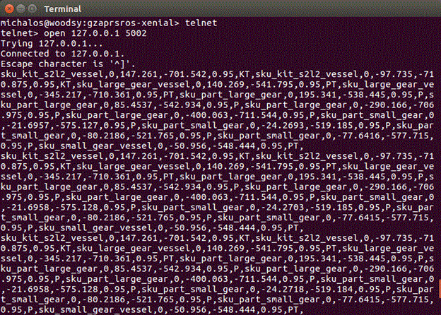
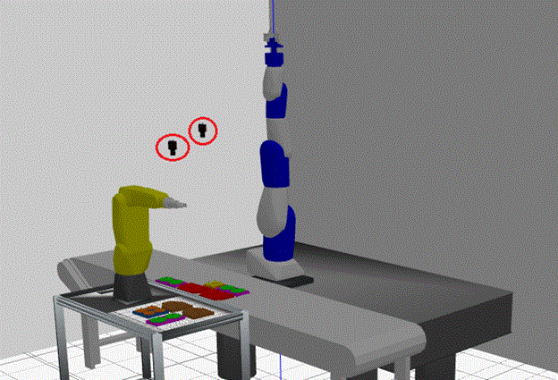
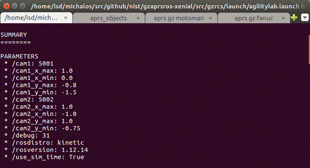

# Gazebo Model Reporting Plugin
----

This readme gives a brief overview of the gzmodelplugin that communicates the active poses of all the kitting  related objects in the simulation world. The algorithm to "detect" a kitting object is to see if the model name contains "sku".  The advertised communication message type is gazebo::msgs::Model  which is a predefined Gazebo message type. The communication topic is hard-coded as ~/ariac/model. Below is the <plugin> XML to include the publishing of the kitting model object pose.  
## Requirements


- Gazebo 9 + SDK
- For QT: Gazebo ignition math 4, ignition msgs1, ignition transport4 and sdformat-6.2 Or modify the qmake pro file.

Only tested with ROS kinetic and Ubuntu 16.04 LTS


## Build



To build, either 
1. compile top level with ROS "catkin_make install" and dlls will be copied to plugins9
2. invoke Qt 5.9.1 IDE and compile. 



The gzmodelplugin  plugin is a linked library used to publish the poses of all the models in the Gazebo simulation that contain sku as part of their name. Part of the published datais the bounding box of the model so that in testing gzrcs can determine the top offset in which to grab the object (not implemented but communicated). The object model data is published on the topic name ~/ariac/model as the message type: gazebo::msgs::Model.



This pose model information can also be used as a vision simulator to feed to an APRS framework controller.




###   Gazebo World

The gazebo sdf world includes the gzmodelplugin as a model plugin for the world. 


###  Example


		<world>
		. . .
		   <plugin filename="libgzmodelplugin.so" name="model_info">
			<debug> 0 </debug>
		   </plugin>
		</world>
# Background

There are two primary purposes for the kitting model information: vision simulation and for testing.  In testing, the grasping of the top of a gear is an important element in transferring a gear from a tray to a kit. However, one system configuration variable that must be hard coded and adjusted according to the object is the grasping offset from the given object pose. Contained within the model plugin are a couple ways to return the bounding box of the object in the commmunication message from which it is assumed, the grasping offset can be determined. Since gears are the only objects being grasped in the kitting simulation, the only difference in grasping location is based on the size of the gear. However, the bounding box is provided for each kitting object, but is currently not used so the hard-coded z offset is still used.



The kitting model object pose information primary purpose is to be used by a vision simulator which reformats the information into the same format as the APRS laboratory vision system.  The folder src/aprs_objects contains the code to read the Gazebo communication and then reformat into the vision simulation format that is streamed as text over port 5001 or 5002 (configurable by ROS params at startup). If you use the agilitydemo bash scripts they launch a script to read the Gazebo model update and translate into the APRS agility lab vision reporting format. Below is a screen shot of a telnet session that connects to the vision simulator stream (port 5002):

    



There is a vision simulation of the APRS agility lab vision system in the folder src/aprs_objects that uses the Gazebo World model. The vision simulation code uses ULAPI, Gazebo and ROS to communicate, command, control a TCP stream of simulated vision data. The vision simulated format is continually streamed  to different ports depending on the configuration, but in general on port #5002 (Motoman robot camera) and port #5001 for (Fanuc robot camera). The vision simulation code generates a line per object pose detailing all the detected objects in its field of view. The vision report contains the object, type, confidence and xy position. There is no z position as the camera sensing is not adroit enough, so the vision simulation code discards the z value from the Gazebo model information.  Therein, the agility lab vision format is: 
	parttype,rotation, x,y, confidence%, metatype,



where:
	parttype= { sku_part_large_gear |sku_part_small_gear| sku_small_gear_vessel | sku_large_gear_vessel | sku_kit_s2l2_vessel}
	metatype = { P|PT| KT}
	rot = (0,360)
	confidence= (0,100)

for example:
	sku_part_large_gear,-0.15,716.51, 296.00,0.99,P,



Upon operation, the visual simulation code creates a ROS aprs_objects_node that is a Gazebo client while performing minimal ROS interaction – console logging output and parameter reading.  Below are the two simulated cameras circled in read (which can actually return images) with one camera analyzing the Fanuc LRMate kitting working volume and the other camera analyzing the Motoman sia200D kitting working volume.

Thus, aprs_objects_node is configurable using ROS params at ROS startup. You can see these parameters upon startup of the ROS master. Parameters "cam1"  and "cam2" define the TCP socket ports on which to stream the simulated vision data. Then, each camera needs an XY bounding box to  define its focus area for which it will "find" kitting objects. For camera1 these include: "cam1_x_min", "cam1_y_min",  "cam1_x_max" , and "cam1_y_max" . Likewise, camera2 has bounding box ROS params: "cam2_x_min", "cam2_y_min",  "cam2_x_max" , and "cam2_y_max". The values for these ROS params are displayed at startup of the ROS master:



So these camera ROS parameters bounding boxes are defined in a Gazebo world space which uses meters as units. After reading these values, the vision simulator will then filter objects based on pose location to produce simulated values for either camera1 or camera2 to stream to the appropriate TCP port.

These camera parameters are set in the launch file:
	<launch>
	<env name="GAZEBO_MEDIA_PATH"  value="$(find gzrcs)/../../gzdatabase/media" />   
	<env name="GAZEBO_PLUGIN_PATH"  value="$(find gzrcs)/../../plugins9" />   
	<env name="GAZEBO_MODEL_PATH"  value="$(find gzrcs)/../../gzdatabase/models" />   
	<env name="GAZEBO_RESOURCE_PATH"  value="$(find gzrcs)/../../Worlds" />   
		<!-- These params are for aprs_object vision simulator   -->
		<param name="debug" value="31" type="int" />
		<param name="cam1" value="5001" type="int" />
		<param name="cam2" value="5002" type="int" />
		<param name="cam1_x_min" value="0" type="double" />
		<param name="cam1_y_min" value="-1.5" type="double" />
		<param name="cam1_x_max" value="1" type="double" />
		<param name="cam1_y_max" value="-0.8" type="double" />
		<param name="cam2_x_min" value="-1" type="double" />
		<param name="cam2_y_min" value="-0.75" type="double" />
		<param name="cam2_x_max" value="1" type="double" />
		<param name="cam2_y_max" value="1" type="double" />
		
	  <include file="$(find gazebo_ros)/launch/empty_world.launch">
	    <arg name="world_name" value="aprs-lab.world"/> <!-- Note: the world_name is with respect to GAZEBO_RESOURCE_PATH environmental variable -->
	    <arg name="paused" value="false"/>
	    <arg name="use_sim_time" value="true"/>
	    <arg name="gui" value="true"/>
	    <arg name="recording" value="false"/>
	    <arg name="debug" default="0" />
	  </include>
	</launch>






